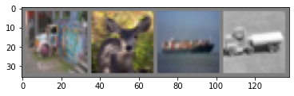

### <u> Creating a Neural Network for CIFAR-10 Classification </u>

#### References:

* The code in this blog post can be found directly from the PyTorch tutorial [here](https://pytorch.org/tutorials/beginner/blitz/cifar10_tutorial.html#sphx-glr-beginner-blitz-cifar10-tutorial-py).  
* For information on the CIFAR-10 dataset, a reference page can be found [here](https://www.kaggle.com/c/cifar-10).  
* In the section marked "Contribution", the provided code follows directly from the tutorial above, however there were slight modifications made to layer amounts and layer size for the purpose of comparing classification performance.

#### Goal of this post:

* The goal of this post is to provide an introduction into creating a neural network for classifying the CIFAR-10 data set, and to explore modifications that may or may not improve its accuracy.  We will look how these modifications  affect the classification performance.  

We'll begin by importing the torch package as we'll be using some built in functions for building the neural network.  

```python
import torch
import torchvision
import torchvision.transforms as transforms
```

Here, we're simply downloading and uploading the CIFAR-10 images, while compartmentlizing them to multiple data sets labled "trainset" and "testset".  We'll also perform an operation called "normalizing" on our datasets.  This step is merely for ease of computational performance.  We're not affecting the integrity of the datasets.  

```python
# Downloading the CIFAR-10 data set, normalizing the image values in between
# -1 and 1, compartmentalizing the data sets into training and testing sets.
transform = transforms.Compose(
    [transforms.ToTensor(),
     transforms.Normalize((0.5, 0.5, 0.5), (0.5, 0.5, 0.5))])

batch_size = 4

trainset = torchvision.datasets.CIFAR10(root='./data', train=True,
                                        download=True, transform=transform)
trainloader = torch.utils.data.DataLoader(trainset, batch_size=batch_size,
                                          shuffle=True, num_workers=2)

testset = torchvision.datasets.CIFAR10(root='./data', train=False,
                                       download=True, transform=transform)
testloader = torch.utils.data.DataLoader(testset, batch_size=batch_size,
                                         shuffle=False, num_workers=2)

classes = ('plane', 'car', 'bird', 'cat',
           'deer', 'dog', 'frog', 'horse', 'ship', 'truck')
```

```
Files already downloaded and verified
Files already downloaded and verified
```

Now, let's visualize some of the images to see what we're working with!

```python
import matplotlib.pyplot as plt
import numpy as np

def imshow(img):
    img = img / 2 + 0.5 
    npimg = img.numpy()
    plt.imshow(np.transpose(npimg, (1, 2, 0)))
    plt.show()

dataiter = iter(trainloader)
images, labels = dataiter.next()

imshow(torchvision.utils.make_grid(images))
print(' '.join('%5s' % classes[labels[j]] for j in range(batch_size)))
```



```
truck  deer  ship truck
```

Above, we see some small images of a "horse, frog, dog, and deer".  As a reminder, each image is of size 32x32 pixels.  

#### Building Our Neural Network

At this step, we'll be creating a simple neural network structure utilzing two convolutional layers and three fully connected layers.  We'll be using the cross-entropy loss function.  Our activation functions across each layer will be $f(x) = max{x,0}$.  

```python
# Defining our neural network
import torch.nn as nn
import torch.nn.functional as F

class Net(nn.Module):
    def __init__(self):
        super().__init__()
        self.conv1 = nn.Conv2d(3, 6, 5)
        # Maxpool has a kernel size of 2x2 with a stride of 2
        self.pool = nn.MaxPool2d(2, 2)
        self.conv2 = nn.Conv2d(6, 16, 5)
        self.fc1 = nn.Linear(16 * 5 * 5, 120)
        self.fc2 = nn.Linear(120, 84)
        # The last number out has to be the number of classes to predict.
        self.fc3 = nn.Linear(84, 10)

    def forward(self, x):
        x = self.pool(F.relu(self.conv1(x)))
        x = self.pool(F.relu(self.conv2(x)))
        x = torch.flatten(x, 1) # flatten all dimensions except batch
        x = F.relu(self.fc1(x))
        x = F.relu(self.fc2(x))
        x = self.fc3(x)
        return x


net = Net()
```

```python
# Defining our loss (objective) function and optimizier
import torch.optim as optim

criterion = nn.CrossEntropyLoss()
optimizer = optim.SGD(net.parameters(), lr=0.001, momentum=0.9)
```

#### Training Our Neural Network

At this point, we've designed our neural network and we're ready to train our model.  We'll run the network through a series of iterations, hopefully building a decent a prediction function.  

```python
for epoch in range(2):  # loop over the dataset multiple times

    running_loss = 0.0
    for i, data in enumerate(trainloader, 0):
        # get the inputs; data is a list of [inputs, labels]
        inputs, labels = data

        # zero the parameter gradients
        optimizer.zero_grad()

        # forward + backward + optimize
        outputs = net(inputs)
        loss = criterion(outputs, labels)
        loss.backward()
        optimizer.step()

        # print statistics
        running_loss += loss.item()
        if i % 2000 == 1999:    # print every 2000 mini-batches
            print('[%d, %5d] loss: %.3f' %
                  (epoch + 1, i + 1, running_loss / 2000))
            running_loss = 0.0

print('Finished Training')
```

```
[1,  2000] loss: 2.177
[1,  4000] loss: 1.798
[1,  6000] loss: 1.643
[1,  8000] loss: 1.554
[1, 10000] loss: 1.492
[1, 12000] loss: 1.424
[2,  2000] loss: 1.368
[2,  4000] loss: 1.337
[2,  6000] loss: 1.330
[2,  8000] loss: 1.323
[2, 10000] loss: 1.287
[2, 12000] loss: 1.265
Finished Training
```

#### Testing Our Neural Network

Now that we've trained our neural network, we can test it on our test data set.  Hopefully we'll get a decent performance!  

```python
# Testing our neural network on the test data set
dataiter = iter(testloader)
images, labels = dataiter.next()

# print images
imshow(torchvision.utils.make_grid(images))
print('GroundTruth: ', ' '.join('%5s' % classes[labels[j]] for j in range(4)))


### This part is not necessary ###
net = Net()
net.load_state_dict(torch.load(PATH))
##################################

# Letting the neural network classify the testing data set
outputs = net(images)

# Getting the index of the highest energy
_, predicted = torch.max(outputs, 1)

print('Predicted: ', ' '.join('%5s' % classes[predicted[j]]
                              for j in range(4)))


# Testing to see how the network performs on the whole dataset
correct = 0
total = 0
# since we're not training, we don't need to calculate the gradients for our outputs
with torch.no_grad():
    for data in testloader:
        images, labels = data
        # calculate outputs by running images through the network
        outputs = net(images)
        # the class with the highest energy is what we choose as prediction
        _, predicted = torch.max(outputs.data, 1)
        total += labels.size(0)
        correct += (predicted == labels).sum().item()

print('Accuracy of the network on the 10000 test images: %d %%' % (
    100 * correct / total))
```


```
GroundTruth:    cat  ship  ship plane
Predicted:    cat   car   car plane
Accuracy of the network on the 10000 test images: 53 %
```

```python
# Figuring out what classes performed well vs poorly
# prepare to count predictions for each class
correct_pred = {classname: 0 for classname in classes}
total_pred = {classname: 0 for classname in classes}

# again no gradients needed
with torch.no_grad():
    for data in testloader:
        images, labels = data
        outputs = net(images)
        _, predictions = torch.max(outputs, 1)
        # collect the correct predictions for each class
        for label, prediction in zip(labels, predictions):
            if label == prediction:
                correct_pred[classes[label]] += 1
            total_pred[classes[label]] += 1


# print accuracy for each class
for classname, correct_count in correct_pred.items():
    accuracy = 100 * float(correct_count) / total_pred[classname]
    print("Accuracy for class {:5s} is: {:.1f} %".format(classname,
                                                   accuracy))
```

```
Accuracy for class plane is: 65.9 %
Accuracy for class car   is: 83.2 %
Accuracy for class bird  is: 65.4 %
Accuracy for class cat   is: 26.1 %
Accuracy for class deer  is: 30.1 %
Accuracy for class dog   is: 41.3 %
Accuracy for class frog  is: 68.6 %
Accuracy for class horse is: 52.4 %
Accuracy for class ship  is: 58.0 %
Accuracy for class truck is: 48.4 %
```

# <u> Contribution </u>

In this section, we'll make adjustments to the neural network defined above by increasing the number of network layers and layer size.

### Part 1:  Changing Neurons Per Layer

In the tutorial, we started with two convolutional layers with given neurons per layer.  We'll vary the number of neurons per layer between 30 and 180.  We'll look at their differences in performances.

```python
# Defining our neural network
information = np.zeros((8,3));
j = 0; N = 200; k = 5; kp = 2;  s = 2; 

for n in range(30,181,20):
    learning_rate = 0.0015
    
    print("Currently training model", j+1, "of 8.")

    class Net(nn.Module):
        def __init__(self):
            super().__init__()

            self.pool = nn.MaxPool2d(kp, s)
            self.conv1 = nn.Conv2d(3, n, k)
            self.conv2 = nn.Conv2d(n, N, k) 
            self.fc1 = nn.Linear(N * 5 * 5, 100)
            self.fc2 = nn.Linear(100, 84)
            self.fc3 = nn.Linear(84, 10)

        def forward(self, x):
            x = self.pool(F.relu(self.conv1(x)))
            x = self.pool(F.relu(self.conv2(x)))
            x = torch.flatten(x, 1) # flatten all dimensions except batch
            x = F.relu(self.fc1(x))
            x = F.relu(self.fc2(x))
            x = self.fc3(x)
            return x

    net_multi = Net()
    criterion_multi = nn.CrossEntropyLoss()
    optimizer_multi = optim.SGD(net_multi.parameters(), lr=learning_rate, momentum=0.9)

    # Training our network
    for epoch in range(3):  # loop over the dataset multiple times
        
        running_loss_multi = 0
        for i, data in enumerate(trainloader, 0):
            inputs, labels = data
            optimizer_multi.zero_grad()
            outputs = net_multi(inputs)
            loss_multi = criterion_multi(outputs, labels)
            loss_multi.backward()
            optimizer_multi.step()
            
                    # print statistics
            running_loss_multi += loss_multi.item()
            if i % 5000 == 4999:    # print every 5000 mini-batches
                print('[%d, %5d] loss: %.3f' %
                      (epoch + 1, i + 1, running_loss_multi / 5000))
                running_loss_multi = 0.0
 
    correct = 0
    total = 0

    with torch.no_grad():
        for data in testloader:
            images, labels = data
            # calculate outputs by running images through the network
            outputs = net_multi(images)
            # the class with the highest energy is what we choose as prediction
            _, predicted = torch.max(outputs.data, 1)
            total += labels.size(0)
            correct += (predicted == labels).sum().item()

    information[j,:] = [n,N,100*correct/total]
    j += 1; 
    

print("Finished Training")
```

```
Currently training model 1 of 8.
[1,  5000] loss: 1.748
[1, 10000] loss: 1.372
[2,  5000] loss: 1.097
[2, 10000] loss: 1.017
[3,  5000] loss: 0.838
[3, 10000] loss: 0.836
Currently training model 2 of 8.
[1,  5000] loss: 1.734
[1, 10000] loss: 1.328
[2,  5000] loss: 1.071
[2, 10000] loss: 0.997
[3,  5000] loss: 0.821
[3, 10000] loss: 0.811
Currently training model 3 of 8.
[1,  5000] loss: 1.711
[1, 10000] loss: 1.328
[2,  5000] loss: 1.058
[2, 10000] loss: 0.994
[3,  5000] loss: 0.809
[3, 10000] loss: 0.814
Currently training model 4 of 8.
[1,  5000] loss: 1.702
[1, 10000] loss: 1.310
[2,  5000] loss: 1.033
[2, 10000] loss: 0.959
[3,  5000] loss: 0.782
[3, 10000] loss: 0.784
Currently training model 5 of 8.
[1,  5000] loss: 1.703
[1, 10000] loss: 1.332
[2,  5000] loss: 1.050
[2, 10000] loss: 0.968
[3,  5000] loss: 0.799
[3, 10000] loss: 0.795
Currently training model 6 of 8.
[1,  5000] loss: 1.707
[1, 10000] loss: 1.318
[2,  5000] loss: 1.061
[2, 10000] loss: 0.973
[3,  5000] loss: 0.801
[3, 10000] loss: 0.800
Currently training model 7 of 8.
[1,  5000] loss: 1.695
[1, 10000] loss: 1.311
[2,  5000] loss: 1.040
[2, 10000] loss: 0.964
[3,  5000] loss: 0.790
[3, 10000] loss: 0.789
Currently training model 8 of 8.
[1,  5000] loss: 1.707
[1, 10000] loss: 1.303
[2,  5000] loss: 1.029
[2, 10000] loss: 0.967
[3,  5000] loss: 0.784
[3, 10000] loss: 0.797
Finished Training
```

Let's first turn our attention to the list of loss values throughout each training.  There were a total of eight models being trained with slightly different variations.  The first model had 30 neurons in its hidden layer, while the last model had 180 neurons in its hidden layer.  Each model had 200 neurons in its output layer.  The loss values (average loss values) are displayed every 5000 mini-batch iteration.  Each model's average loss decreased at a consistent rate.

The table above displays the different number of neurons in the input and output layer, respectively, followed by the percent accuracy of prediction.  The best prediction accuracy was 71.42% when 90/200 neurons were used.  The worst prediction accuracy was 67.49% when 50/200 neurons were used.  We'd like to note that the prediction accuracy of each test was better than the tutorial prediction of 53%.  

```python
plt.bar(information[:,0], information[:,2], width = 10)
plt.xlabel("Number of Neurons Per Hidden Layer")
plt.ylabel("% Accuracy")
plt.title("% Accuracy vs Neurons Per Hidden Layer")
print(information)
```

```
[[ 30.   200.    70.73]
 [ 50.   200.    71.15]
 [ 70.   200.    67.49]
 [ 90.   200.    71.42]
 [110.   200.    71.  ]
 [130.   200.    70.44]
 [150.   200.    70.49]
 [170.   200.    70.61]]
```


### Part 2:  Changing Layer Amounts

In this section, we'll change the number of convolutional layers to 3 and 4.  We'll take the best performing model above and have similar neuron amounts per layer.  Similarly, we'll look at the differences in performances.  

### 2.1) 3 Convolutional Layers - 3 Fully Connected Layers

For our first variation, we'll add an additional convoluted layer for a total of three convolutional layers coupled with three fully connected layers.  We'd like to note that in the previous section, the differences in the prediction accuracies based off of the neurons per hidden layer were small, so in this section we'll utilize roughly the same amount of neurons per hidden layer, while keeping the filter size as a $5 \times 5$.  

```python
N = 240; k=5;
learning_rate = 0.002;

class Net(nn.Module):
    def __init__(self):
        super().__init__()

        # Maxpool has a kernel size of 2x2 with a stride of 2. 
        self.pool = nn.MaxPool2d(kp, s)

        # Defining our convolutional layers.
        self.conv1 = nn.Conv2d(3, 100, k)
        self.conv2 = nn.Conv2d(100, 180, k)
        self.conv3 = nn.Conv2d(180, N, k)
        self.fc1 = nn.Linear(N * 1 * 1, 100)
        self.fc2 = nn.Linear(100, 200)
        self.fc3 = nn.Linear(200, 10)

    def forward(self, x):
        x = self.pool(F.relu(self.conv1(x)))
        x = self.pool(F.relu(self.conv2(x)))
        x = F.relu(self.conv3(x))
        x = torch.flatten(x, 1) # flatten all dimensions except batch
        x = F.relu(self.fc1(x))
        x = F.relu(self.fc2(x))
        x = self.fc3(x)
        return x

net_2 = Net()
criterion_2 = nn.CrossEntropyLoss()
optimizer_2 = optim.SGD(net_2.parameters(), lr=learning_rate, momentum=0.9)

# Training our network
for epoch in range(4):  # loop over the dataset multiple times

    loss_ph1 = 0; loss_ph2 = 0;
    running_loss_2 = 0
    for i, data in enumerate(trainloader, 0):
        inputs, labels = data
        optimizer_2.zero_grad()
        outputs = net_2(inputs)
        loss_2 = criterion_2(outputs, labels)
        loss_2.backward()
        optimizer_2.step()
        
        # print statistics
        running_loss_2 += loss_2.item()
        if i % 5000 == 4999:    # print every 5000 mini-batches
            print('[%d, %5d] loss: %.3f' %
                  (epoch + 1, i + 1, running_loss_2 / 5000))
            running_loss_2 = 0.0
        loss_ph2 = loss_ph1;
        loss_ph1 = 0;  

correct = 0
total = 0
    
with torch.no_grad():
    for data in testloader:
        images, labels = data
        outputs = net_2(images)
        _, predicted = torch.max(outputs.data, 1)
        total += labels.size(0)
        correct += (predicted == labels).sum().item()

print("We predicted ", 100*correct/total, "% correct using 3 Convolutional Layers and 3 Fully Connected Layers")
```

```
[1,  5000] loss: 1.496
[1, 10000] loss: 1.317
[2,  5000] loss: 1.029
[2, 10000] loss: 0.973
[3,  5000] loss: 0.827
[3, 10000] loss: 0.800
[4,  5000] loss: 0.667
[4, 10000] loss: 0.662

We predicted  70.49 % correct using 3 Convolutional Layers and 3 Fully Connected Layers
```

The prediction accuracy of our model was 70.49% which is similar to the prediction accuracies from the previous section.  In the next section, we'll add a fourth convolutional layer and explore the differences in performance.  


### 2.1) 4 Convolutional Layers - 3 Fully Connected Layers

In this section, we'll add a fourth convolutional layer to our model for a total of four convolutional layers and three fully connected layers.  In addition, we'll change the filter size in the last two convolutional layers from $5 \times 5$'s to $2 \times 2$'s.  The neurons per hidden convolutional layer are similar to the previous sections.   

```python
import torch.nn as nn
import torch.nn.functional as F
import torch.optim as optim

N = 300; k=3; kp = 2; s = 2; 
learning_rate = 0.005

class Net(nn.Module):
    def __init__(self):
        super().__init__()

        self.pool = nn.MaxPool2d(kp, s)  
        self.conv1 = nn.Conv2d(3, 100, k)
        self.conv2 = nn.Conv2d(100, 180, k)
        self.conv3 = nn.Conv2d(180, 240, 2)
        self.conv4 = nn.Conv2d(240, N, 2)
        self.fc1 = nn.Linear(N * 1 * 1, 100)
        self.fc2 = nn.Linear(100, 200)
        self.fc3 = nn.Linear(200, 10)

    def forward(self, x):
        x = self.pool(F.relu(self.conv1(x)))
        x = self.pool(F.relu(self.conv2(x)))
        x = self.pool(F.relu(self.conv3(x)))
        x = F.relu(self.conv4(x))
        x = torch.flatten(x, 1) # flatten all dimensions except batch
        x = F.relu(self.fc1(x))
        x = F.relu(self.fc2(x))
        x = self.fc3(x)
        return x

net_3 = Net()
criterion_3 = nn.CrossEntropyLoss()
optimizer_3 = optim.SGD(net_3.parameters(), lr=learning_rate, momentum=0.9)

# Training our network
for epoch in range(4):  # loop over the dataset multiple times
    
    loss_ph1_2 = 0; loss_ph2_2 = 0;
    running_loss_3 = 0 
    for i, data in enumerate(trainloader, 0):
        # get the inputs; data is a list of [inputs, labels]
        inputs, labels = data

        # zero the parameter gradients
        optimizer_3.zero_grad()

        # forward + backward + optimize
        outputs = net_3(inputs)
        loss_3 = criterion_3(outputs, labels)
        loss_3.backward()
        optimizer_3.step()

        # print statistics
        running_loss_3 += loss_3.item()
        if i % 5000 == 4999:    # print every 5000 mini-batches
            print('[%d, %5d] loss: %.3f' %
                  (epoch + 1, i + 1, running_loss_3 / 5000))
            running_loss_3 = 0.0 
        
correct = 0
total = 0
    
    # since we're not training, we don't need to calculate the gradients for our outputs
with torch.no_grad():
    for data in testloader:
        images, labels = data
        # calculate outputs by running images through the network
        outputs = net_3(images)
        # the class with the highest energy is what we choose as prediction
        _, predicted = torch.max(outputs.data, 1)
        total += labels.size(0)
        correct += (predicted == labels).sum().item()

print("We predicted", 100*correct/total, "% correct using 4 Convolutional Layers and 3 Fully Connected Layers")
```

```
[1,  5000] loss: 1.733    
[1, 10000] loss: 1.488    
[2,  5000] loss: 1.311    
[2, 10000] loss: 1.281    
[3,  5000] loss: 1.187   
[3, 10000] loss: 1.136
[4,  5000] loss: 1.075
[4, 10000] loss: 1.138

We predicted 61.33 % correct using 4 Convolutional Layers and 3 Fully Connected Layers
```

The prediction accuracy of our new model was 61.33%, which is lower than our previously trained models with two and three convolutional layers.  However, we'd like to note that we believe the change of the filter size in the last two convolutional layers may have had an affect.  The size of the filter affects the model's ability to recognize patterns and underlying features of its incoming information.  Based off the poorer performance, we'd like to suggest that the filter size of $2 \times 2$ was insufficient for recognizing patterns in the images.  

### Conclusion