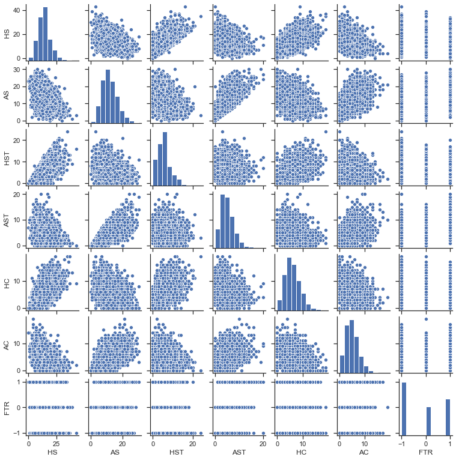

## <u> Final Project:  English Premier League (EPL) Soccer Match Result Classifier </u>

#### <u> References </u> 
* I used the EPL data sets as provided by [Football-Data-Co](https://www.football-data.co.uk/englandm.php).
* I referred to these websites for python general coding questions: [Link 1](https://www.w3schools.com/python/python_arrays.asp), [Link 2](https://scikit-learn.org/stable/user_guide.html), [Link 3](https://www.programiz.com/python-programming).
* The code, blog post, and analysis is entirely original work. 
* Here's a quick link to the step-by-step [read-me](https://github.com/zach-chairez/zach-chairez/blob/main/README.md) which will take you to my GitHub. 


#### <u> Goal </u>

The Barclay’s English Premier League (EPL) is arguably the greatest soccer (football) league in the world.  With the likes of Liverpool, Manchester United, Chelsea, and Arsenal, the EPL is one of the most dynamic, fast paced, unpredictable leagues in the world.  Teams in the EPL play in a 38-match season from September through May of each year, while facing each opposing team twice.  Over the last two decades, [Football-Data-Co](https://www.football-data.co.uk/englandm.php) has gathered results, match statistics, and betting odds of every EPL game.  We’ll be utilizing some of the data to create a fixture prediction model which will give us an output, depending on a certain set of variables, the result of a given match.  

#### <u> Notes for Football Data </u>
Below, you'll find a list of all the past and present variables and match statistics that are available from each season.  Note that some variables are no longer in use.  Later in the post, we'll discuss the different variables that are used and the feature selection methods.   


<br>

Key to results data:
* $\textbf{Date}$ = Match Date (dd/mm/yy)
* $\textbf{Time}$ = Time of match kick off
* $\textbf{HomeTeam}$ = Home Team
* $\textbf{AwayTeam}$ = Away Team
* $\textbf{FTHG and HG}$ = Full Time Home Team Goals
* $\textbf{FTAG and AG}$ = Full Time Away Team Goals
* $\textbf{FTR and Res}$ = Full Time Result (H=Home Win, D=Draw, A=Away Win)
* $\textbf{HTHG}$ = Half Time Home Team Goals
* $\textbf{HTAG}$ = Half Time Away Team Goals
* $\textbf{HTR}$ = Half Time Result (H=Home Win, D=Draw, A=Away Win)

Match Statistics (where available)
* $\textbf{Referee}$ = Match Referee
* $\textbf{HS}$ = Home Team Shots
* $\textbf{AS}$ = Away Team Shots
* $\textbf{HST}$ = Home Team Shots on Target
* $\textbf{AST}$ = Away Team Shots on Target
* $\textbf{HHW}$ = Home Team Hit Woodwork
* $\textbf{AHW}$ = Away Team Hit Woodwork
* $\textbf{HC}$ = Home Team Corners
* $\textbf{AC}$ = Away Team Corners
* $\textbf{HF}$ = Home Team Fouls Committed
* $\textbf{AF}$ = Away Team Fouls Committed
* $\textbf{HFKC}$ = Home Team Free Kicks Conceded
* $\textbf{AFKC}$ = Away Team Free Kicks Conceded
* $\textbf{HO}$= Home Team Offsides
* $\textbf{AO}$ = Away Team Offsides
* $\textbf{HY}$ = Home Team Yellow Cards
* $\textbf{AY}$ = Away Team Yellow Cards
* $\textbf{HR}$ = Home Team Red Cards
* $\textbf{AR}$ = Away Team Red Cards
* $\textbf{HBP}$ = Home Team Bookings Points (10 = yellow, 25 = red)
* $\textbf{ABP}$ = Away Team Bookings Points (10 = yellow, 25 = red)

#### <u> Uploading Data </u>

We'll begin by importing data beginning from the year 2010.  The training data will consist of all the matches between 2010 and 2020.  The most recent full season, 2020-2021, will be our testing set.  The two classification models we'll be utilizing throughout the entirety of this post are $\textbf{Random Forests}$ and $\textbf{Gradient Boosted Trees}$.  Random forests perform well with categorical data as inputs and gradient boosted trees  which creates an ensemble of random forests and chooses the best performance model.  In some cases, as we'll see, the performance between the two of them is comparable.     


```python
# Importing necessary packages:
import pandas as pd
import numpy as np
from sklearn.ensemble import RandomForestClassifier as rf
from sklearn.ensemble import GradientBoostingClassifier as gbt
from sklearn.feature_selection import SelectFromModel as model_select

# -------- Uploading data --------- #

# This will be the set of training data.
# s9_10 = pd.read_csv("C:\\Users\zachc\OneDrive\Desktop\Datasets\Premier League\Season_9_10.csv")
s10_11 = pd.read_csv("C:\\Users\zachc\OneDrive\Desktop\Datasets\Premier League\Season_10_11.csv")
s11_12 = pd.read_csv("C:\\Users\zachc\OneDrive\Desktop\Datasets\Premier League\Season_11_12.csv")
s12_13 = pd.read_csv("C:\\Users\zachc\OneDrive\Desktop\Datasets\Premier League\Season_12_13.csv")
s13_14 = pd.read_csv("C:\\Users\zachc\OneDrive\Desktop\Datasets\Premier League\Season_13_14.csv")
s14_15 = pd.read_csv("C:\\Users\zachc\OneDrive\Desktop\Datasets\Premier League\Season_14_15.csv")
s15_16 = pd.read_csv("C:\\Users\zachc\OneDrive\Desktop\Datasets\Premier League\Season_15_16.csv")
s16_17 = pd.read_csv("C:\\Users\zachc\OneDrive\Desktop\Datasets\Premier League\Season_16_17.csv")
s17_18 = pd.read_csv("C:\\Users\zachc\OneDrive\Desktop\Datasets\Premier League\Season_17_18.csv")
s18_19 = pd.read_csv("C:\\Users\zachc\OneDrive\Desktop\Datasets\Premier League\Season_18_19.csv")
s19_20 = pd.read_csv("C:\\Users\zachc\OneDrive\Desktop\Datasets\Premier League\Season_19_20.csv")

# This will be our testing set.
s20_21 = pd.read_csv("C:\\Users\zachc\OneDrive\Desktop\Datasets\Premier League\Season_20_21.csv")
# all_seasons = pd.concat([s9_10,s10_11,s11_12,s12_13,s13_14,s14_15,s15_16,s16_17,s17_18,s18_19,s19_20,s20_21])
all_seasons = pd.concat([s10_11,s11_12,s12_13,s13_14,s14_15,s15_16,s16_17,s17_18,s18_19,s19_20,s20_21])

# Splitting the date into three separate columns for day, month, and year.
all_seasons[['day','month','year']] = all_seasons['Date'].str.split('/',expand=True)

display(all_seasons.head())
```


<div>
<style scoped>
    .dataframe tbody tr th:only-of-type {
        vertical-align: middle;
    }

    .dataframe tbody tr th {
        vertical-align: top;
    }

    .dataframe thead th {
        text-align: right;
    }
</style>
<table border="1" class="dataframe">
  <thead>
    <tr style="text-align: right;">
      <th></th>
      <th>Div</th>
      <th>Date</th>
      <th>HomeTeam</th>
      <th>AwayTeam</th>
      <th>FTHG</th>
      <th>FTAG</th>
      <th>FTR</th>
      <th>HTHG</th>
      <th>HTAG</th>
      <th>HTR</th>
      <th>...</th>
      <th>HC</th>
      <th>AC</th>
      <th>HY</th>
      <th>AY</th>
      <th>HR</th>
      <th>AR</th>
      <th>Time</th>
      <th>day</th>
      <th>month</th>
      <th>year</th>
    </tr>
  </thead>
  <tbody>
    <tr>
      <th>0</th>
      <td>E0</td>
      <td>14/08/10</td>
      <td>Aston Villa</td>
      <td>West Ham</td>
      <td>3</td>
      <td>0</td>
      <td>H</td>
      <td>2</td>
      <td>0</td>
      <td>H</td>
      <td>...</td>
      <td>16</td>
      <td>7</td>
      <td>1</td>
      <td>2</td>
      <td>0</td>
      <td>0</td>
      <td>NaN</td>
      <td>14</td>
      <td>08</td>
      <td>10</td>
    </tr>
    <tr>
      <th>1</th>
      <td>E0</td>
      <td>14/08/10</td>
      <td>Blackburn</td>
      <td>Everton</td>
      <td>1</td>
      <td>0</td>
      <td>H</td>
      <td>1</td>
      <td>0</td>
      <td>H</td>
      <td>...</td>
      <td>1</td>
      <td>3</td>
      <td>2</td>
      <td>1</td>
      <td>0</td>
      <td>0</td>
      <td>NaN</td>
      <td>14</td>
      <td>08</td>
      <td>10</td>
    </tr>
    <tr>
      <th>2</th>
      <td>E0</td>
      <td>14/08/10</td>
      <td>Bolton</td>
      <td>Fulham</td>
      <td>0</td>
      <td>0</td>
      <td>D</td>
      <td>0</td>
      <td>0</td>
      <td>D</td>
      <td>...</td>
      <td>4</td>
      <td>8</td>
      <td>1</td>
      <td>3</td>
      <td>0</td>
      <td>0</td>
      <td>NaN</td>
      <td>14</td>
      <td>08</td>
      <td>10</td>
    </tr>
    <tr>
      <th>3</th>
      <td>E0</td>
      <td>14/08/10</td>
      <td>Chelsea</td>
      <td>West Brom</td>
      <td>6</td>
      <td>0</td>
      <td>H</td>
      <td>2</td>
      <td>0</td>
      <td>H</td>
      <td>...</td>
      <td>3</td>
      <td>1</td>
      <td>1</td>
      <td>0</td>
      <td>0</td>
      <td>0</td>
      <td>NaN</td>
      <td>14</td>
      <td>08</td>
      <td>10</td>
    </tr>
    <tr>
      <th>4</th>
      <td>E0</td>
      <td>14/08/10</td>
      <td>Sunderland</td>
      <td>Birmingham</td>
      <td>2</td>
      <td>2</td>
      <td>D</td>
      <td>1</td>
      <td>0</td>
      <td>H</td>
      <td>...</td>
      <td>3</td>
      <td>6</td>
      <td>3</td>
      <td>3</td>
      <td>1</td>
      <td>0</td>
      <td>NaN</td>
      <td>14</td>
      <td>08</td>
      <td>10</td>
    </tr>
  </tbody>
</table>
<p>5 rows × 27 columns</p>
</div>


```python
display(all_seasons['HomeTeam'].unique())
```


    array(['Aston Villa', 'Blackburn', 'Bolton', 'Chelsea', 'Sunderland',
           'Tottenham', 'Wigan', 'Wolves', 'Liverpool', 'Man United',
           'Arsenal', 'Birmingham', 'Everton', 'Stoke', 'West Brom',
           'West Ham', 'Fulham', 'Newcastle', 'Man City', 'Blackpool', 'QPR',
           'Swansea', 'Norwich', 'Reading', 'Southampton', 'Crystal Palace',
           'Hull', 'Cardiff', 'Leicester', 'Burnley', 'Bournemouth',
           'Watford', 'Middlesbrough', 'Brighton', 'Huddersfield',
           'Sheffield United', 'Leeds'], dtype=object)


The array above displays all 37 unique teams that have every played in the EPL since 2010.  The number of teams in the EPL at any given time is 20.  At the end of every season, the bottom three teams are booted out of the league and drop to the second division, where the top three teams of the second division take their place in the following season.  This system allows for a more competitive and open style of advancement, unlike that of the American sports leagues where being at the bottom of a table does not affect your opportunities for next seasons placements.  

##  <u> Part 1:  Ignorant yet Simple Approach </u>

As we've seen previously, they're plenty of variables which can, potentially, be used for predicting a win, loss, or draw.  However, in this first section, we'll use only a few variables to try to predict a win, loss, or draw based off our naive and simple intuition:  $\textbf{Home teams tend to perform better than away teams}$.  In the second section, we'll do some data exploration and intuitive analysis to pick additional variables which may help the performance of our predictor.    

#### <u> Picking our explanatory variables </u>
They're a few variables whose information are known prior and up to the start of any game such as $\textbf{Date, HomeTeam, AwayTeam, and Referee}$.  We'll explore and potentially utilize these variables for building our classifier. 

The response variable we're after is $\textbf{FTR}$ which corresponds to the full time result.  The three classes for FTR are:
* $\textbf{H}$ = Home Team wins
* $\textbf{A}$ = Away Team Wins
* $\textbf{D}$ = Draw or Tie


Before we begin, we'll take these variables and turn them into categorical variables the model will understand.

#### <u> Data Pre-Processing </u>


```python
# Creating variables which represent our explanatory variables.
date = all_seasons.Date; ht = all_seasons.HomeTeam
at = all_seasons.AwayTeam; ref = all_seasons.Referee
ftr = all_seasons.FTR; day = all_seasons.day
month = all_seasons.month; year = all_seasons.year 

# Turning some of our explanatory variables into categorical variables
ht_cat = ht.astype('category'); at_cat = at.astype('category')
ref_cat = ref.astype('category'); ftr_cat = ftr.astype('category')
day_cat = day.astype('category'); month_cat = month.astype('category')

# Turning the new categorical variables into integer classes
ht_cat = ht_cat.cat.codes; at_cat = at_cat.cat.codes
ref_cat = ref_cat.cat.codes; ftr_cat = ftr_cat.cat.codes
day_cat = day_cat.cat.codes; month_cat = month_cat.cat.codes

all_seasons = pd.concat([all_seasons,ht_cat,at_cat,ref_cat,day_cat,month_cat,ftr_cat],axis = 1)
all_seasons = all_seasons.rename(columns = {0: "HT_Cat", 1 :"AT_Cat", 2:"Ref_Cat", 3: "day_Cat", 4:"month_Cat",5:"FTR_Cat"})
```


```python
temp = all_seasons[['HomeTeam', 'HT_Cat', 'AwayTeam', 'AT_Cat', 'FTR', 'FTR_Cat', 'Referee', 'Ref_Cat', 'Date', 'day', 'month']]
display(temp.head())
```


<div>
<style scoped>
    .dataframe tbody tr th:only-of-type {
        vertical-align: middle;
    }

    .dataframe tbody tr th {
        vertical-align: top;
    }

    .dataframe thead th {
        text-align: right;
    }
</style>
<table border="1" class="dataframe">
  <thead>
    <tr style="text-align: right;">
      <th></th>
      <th>HomeTeam</th>
      <th>HT_Cat</th>
      <th>AwayTeam</th>
      <th>AT_Cat</th>
      <th>FTR</th>
      <th>FTR_Cat</th>
      <th>Referee</th>
      <th>Ref_Cat</th>
      <th>Date</th>
      <th>day</th>
      <th>month</th>
    </tr>
  </thead>
  <tbody>
    <tr>
      <th>0</th>
      <td>Aston Villa</td>
      <td>1</td>
      <td>West Ham</td>
      <td>34</td>
      <td>H</td>
      <td>2</td>
      <td>M Dean</td>
      <td>18</td>
      <td>14/08/10</td>
      <td>14</td>
      <td>08</td>
    </tr>
    <tr>
      <th>1</th>
      <td>Blackburn</td>
      <td>3</td>
      <td>Everton</td>
      <td>12</td>
      <td>H</td>
      <td>2</td>
      <td>P Dowd</td>
      <td>25</td>
      <td>14/08/10</td>
      <td>14</td>
      <td>08</td>
    </tr>
    <tr>
      <th>2</th>
      <td>Bolton</td>
      <td>5</td>
      <td>Fulham</td>
      <td>13</td>
      <td>D</td>
      <td>1</td>
      <td>S Attwell</td>
      <td>31</td>
      <td>14/08/10</td>
      <td>14</td>
      <td>08</td>
    </tr>
    <tr>
      <th>3</th>
      <td>Chelsea</td>
      <td>10</td>
      <td>West Brom</td>
      <td>33</td>
      <td>H</td>
      <td>2</td>
      <td>M Clattenburg</td>
      <td>17</td>
      <td>14/08/10</td>
      <td>14</td>
      <td>08</td>
    </tr>
    <tr>
      <th>4</th>
      <td>Sunderland</td>
      <td>29</td>
      <td>Birmingham</td>
      <td>2</td>
      <td>D</td>
      <td>1</td>
      <td>A Taylor</td>
      <td>3</td>
      <td>14/08/10</td>
      <td>14</td>
      <td>08</td>
    </tr>
  </tbody>
</table>
</div>


The columns HomeTeam, AwayTeam, FTR, Referee, and FTR have now been turned into categorical variables with particular integer assignments.  These new variables will be the inputs we use for our classifiers as opposed to strings.  In addition, we've split the date into multiple columns with their associated day and month.  Notice how we did not create a column for the year.  In this case, we're ignoring the time component of the data and simply categorizing the day and month as particular classes.  

#### <u> Separating the Training and Testing Sets </u>
Here, we'll separate all of the seasons between the training and testing data sets.  Seasons 2010-2020 will be in our training set, while the last season, 2020-2021, will be our testing set.  


```python
train = all_seasons.iloc[:3800,:]

# Creating variables which represent our explanatory variables.
date = train.Date; ht_train = train.HT_Cat
at_train = train.AT_Cat; ref_train = train.Ref_Cat
ftr_train = train.FTR_Cat; day_train = train.day_Cat;
month_train = train.month_Cat

# Concatenating the explanatory variables into a single dateframe with
# with their associated categorizations for the training set. 
ind = pd.concat([ht_train,at_train,ref_train],axis = 1)
ind_noref = pd.concat([ht_train,at_train],axis = 1)
ind2 = pd.concat([ht_train,at_train,ref_train,day_train,month_train],axis = 1)
ind2_noref = pd.concat([ht_train,at_train,day_train,month_train],axis = 1)
```


```python
# Calling the most recent season our test set.
test = all_seasons.iloc[3800:,:]

# Creating variables which represent our explanatory variables
# for our test set.
date_test = test.Date; ht_test = test.HT_Cat
at_test = test.AT_Cat; ref_test = test.Ref_Cat
ftr_test = test.FTR_Cat; day_test = test.day_Cat;
month_test = test.month_Cat

# Concatenating the explanatory variables into a single dateframe with
# with their associated categorizations four the test set.
ind_test = pd.concat([ht_test,at_test,ref_test], axis = 1)
ind_test_noref = pd.concat([ht_test,at_test], axis = 1)
ind2_test = pd.concat([ht_test,at_test,ref_test,day_test,month_test], axis = 1)
ind2_test_noref = pd.concat([ht_test,at_test,day_test,month_test], axis = 1)
```

#### <u> Training our Classifier </u>
Here, we'll train two different classifiers, each with two variations, for a total of four different models.  

<br>
<u> $\textbf{Classifier 1:}$ </u>

* Random Forest with variables HT_Cat, AT_Cat, Ref_Cat, day_Cat, and month_Cat
* Random Forest with variables HT_Cat, AT_Cat, day_Cat, and month_Cat

<br>

<u> $\textbf{Classifier 2:}$ </u>
* Gradient Boosted Tree with variables HT_Cat, AT_Cat, Ref_Cat, day_Cat, and month_Cat
* Gradient Boosted Tree with variables HT_Cat, AT_Cat, day_Cat, and month_Cat


```python
model1 = rf(n_estimators = 500,criterion = 'entropy').fit(ind2,ftr_train)
model1_noref = rf(n_estimators = 500,criterion = 'entropy').fit(ind2_noref,ftr_train)

model2 = gbt(n_estimators = 500, learning_rate = 0.25).fit(ind2,ftr_train)
model2_noref = gbt(n_estimators = 500, learning_rate = 0.25).fit(ind2_noref,ftr_train)
```

#### <u> Testing </u>
We'll now take our four different models and test them on the final season (test set).  


```python
# model_rbf.predict(ind_test)
pred = model1.predict(ind2_test)
prob = model1.predict_proba(ind2_test)
pred_noref = model1_noref.predict(ind2_test_noref)
prob_noref = model1_noref.predict_proba(ind2_test_noref)

pred_gbt = model2.predict(ind2_test)
prob_gbt = model2.predict_proba(ind2_test)
pred_gbt_noref = model2_noref.predict(ind2_test_noref)
prob_gbt_noref = model2_noref.predict_proba(ind2_test_noref)
```

#### <u> Checking Accuracy </u> 


```python
# Accuracy of Random Forest
# Using HT, AT, Ref, Day, Month
acc1 = np.zeros(len(test))
for i in range(len(test)):
    if pred[i] == ftr_test.iloc[i]:
        acc1[i] = 1
print("The accuracy of the random forest is", '{:.2f}'.format(sum(acc1)/len(test)*100), '%.')

# Accuracy of Random Forest without Ref
# Using HT, AT,, Day, Month
acc3 = np.zeros(len(test))
for i in range(len(test)):
    if pred_noref[i] == ftr_test.iloc[i]:
        acc3[i] = 1
print("The accuracy of the random forest without the ref is", '{:.2f}'.format(sum(acc2)/len(test)*100), '%.')

# Accuracy of Gradient Boosted Trees
# Using HT, AT, Ref, Day, Month
acc2 = np.zeros(len(test))
for i in range(len(test)):
    if pred_gbt[i] == ftr_test.iloc[i]:
        acc2[i] = 1
print("The accuracy of the gradient boosted tree is", '{:.2f}'.format(sum(acc3)/len(test)*100), '%.')

# Accuracy of Gradient Boosted Trees without ref
# Using HT, AT, Day, Month
acc4 = np.zeros(len(test))
for i in range(len(test)):
    if pred_gbt_noref[i] == ftr_test.iloc[i]:
        acc4[i] = 1
print("The accuracy of the gradient boosted tree without ref is", '{:.2f}'.format(sum(acc4)/len(test)*100), '%.')
```

    The accuracy of the random forest is 46.32 %.
    The accuracy of the random forest without the ref is 41.05 %.
    The accuracy of the gradient boosted tree is 42.11 %.
    The accuracy of the gradient boosted tree without ref is 42.63 %.
    

#### <u> Discussion </u> 
We've displayed only a few of the experiments from this training and testing procedure.  The accuracies displayed above are approximately equal to the mean accuracies.  The highest accuracy was the original random forest with the inclusion of the referee with $46.32$%. This basic and ignorant approach to our classifier shows in the acccuracy.  In the next section, we'll perform the same methods, however we'll include more variables we believe will add accuracy to the predictions.  One comment before we move onto the next section.  You may be asking yourself $\textbf{Why is there so much emphasis on using/not using the variable Ref?}$.  This question is valid, yet a little controversial.  Depending on what kind of EPL fans you ask, they may say that the existence of a particular referee has no effect on the outcome of a game, while others may wholeheartedly disagree.  A referee may be more lineant or strict during a football match, resulting in more free kicks, penalty kicks, yellow and red cards, which may affect the performance of the teams.  To include this notion, we've made different models that use versus don't use the referee as an explanatory variable.  As we see from the random forest, the inclusion of the ref has a slight effect on its performance.    

## <u> Part 2:  Data Exploration and Additional Predictors </u>  

#### <u> Some Data Exploration </u>
We'll look at the connections, if any, between the variables with the full time result (FTR), and with each other.  This will help us identify potential explanatory variables.


```python
# Importing package for scatterplot matrix 
import seaborn as sns
import matplotlib.pyplot as plt 
sns.set(style="ticks")

# Gathering the above predictors as their own variables
hs = all_seasons.HS; as_ = all_seasons.AS
hst = all_seasons.HST; ast = all_seasons.AST
hc = all_seasons.HC; ac = all_seasons.AC
hf = all_seasons.HF; af = all_seasons.AF
hy = all_seasons.HY; ay = all_seasons.AY
hr = all_seasons.HR; ar = all_seasons.AR

ftr_copy = ftr.copy()
ftr_copy = ftr_copy.replace(to_replace = ['H','D','A'], value = [-1,0,1])
```


```python
match_stats = pd.concat([hs,as_,hst,ast,hc,ac,hf,af,hy,ay,hr,ar,ftr_copy], axis = 1)
match_stats.corr()
```


<div>
<style scoped>
    .dataframe tbody tr th:only-of-type {
        vertical-align: middle;
    }

    .dataframe tbody tr th {
        vertical-align: top;
    }

    .dataframe thead th {
        text-align: right;
    }
</style>
<table border="1" class="dataframe">
  <thead>
    <tr style="text-align: right;">
      <th></th>
      <th>HS</th>
      <th>AS</th>
      <th>HST</th>
      <th>AST</th>
      <th>HC</th>
      <th>AC</th>
      <th>HF</th>
      <th>AF</th>
      <th>HY</th>
      <th>AY</th>
      <th>HR</th>
      <th>AR</th>
      <th>FTR</th>
    </tr>
  </thead>
  <tbody>
    <tr>
      <th>HS</th>
      <td>1.000000</td>
      <td>-0.404569</td>
      <td>0.652903</td>
      <td>-0.247816</td>
      <td>0.525792</td>
      <td>-0.314373</td>
      <td>-0.109513</td>
      <td>-0.023341</td>
      <td>-0.099015</td>
      <td>0.045332</td>
      <td>-0.106555</td>
      <td>0.113046</td>
      <td>-0.228426</td>
    </tr>
    <tr>
      <th>AS</th>
      <td>-0.404569</td>
      <td>1.000000</td>
      <td>-0.268278</td>
      <td>0.657468</td>
      <td>-0.330019</td>
      <td>0.512414</td>
      <td>0.037878</td>
      <td>-0.060712</td>
      <td>0.103559</td>
      <td>-0.067002</td>
      <td>0.126252</td>
      <td>-0.098535</td>
      <td>0.253485</td>
    </tr>
    <tr>
      <th>HST</th>
      <td>0.652903</td>
      <td>-0.268278</td>
      <td>1.000000</td>
      <td>-0.008846</td>
      <td>0.345506</td>
      <td>-0.178201</td>
      <td>-0.082609</td>
      <td>-0.041715</td>
      <td>-0.121420</td>
      <td>0.027808</td>
      <td>-0.071285</td>
      <td>0.082578</td>
      <td>-0.339838</td>
    </tr>
    <tr>
      <th>AST</th>
      <td>-0.247816</td>
      <td>0.657468</td>
      <td>-0.008846</td>
      <td>1.000000</td>
      <td>-0.179340</td>
      <td>0.320433</td>
      <td>0.024622</td>
      <td>-0.059451</td>
      <td>0.058547</td>
      <td>-0.044616</td>
      <td>0.115963</td>
      <td>-0.073712</td>
      <td>0.324652</td>
    </tr>
    <tr>
      <th>HC</th>
      <td>0.525792</td>
      <td>-0.330019</td>
      <td>0.345506</td>
      <td>-0.179340</td>
      <td>1.000000</td>
      <td>-0.265673</td>
      <td>-0.095979</td>
      <td>-0.014330</td>
      <td>-0.057457</td>
      <td>0.042573</td>
      <td>-0.059610</td>
      <td>0.059775</td>
      <td>-0.063347</td>
    </tr>
    <tr>
      <th>AC</th>
      <td>-0.314373</td>
      <td>0.512414</td>
      <td>-0.178201</td>
      <td>0.320433</td>
      <td>-0.265673</td>
      <td>1.000000</td>
      <td>0.014073</td>
      <td>-0.045948</td>
      <td>0.048999</td>
      <td>-0.047512</td>
      <td>0.089113</td>
      <td>-0.061682</td>
      <td>0.040764</td>
    </tr>
    <tr>
      <th>HF</th>
      <td>-0.109513</td>
      <td>0.037878</td>
      <td>-0.082609</td>
      <td>0.024622</td>
      <td>-0.095979</td>
      <td>0.014073</td>
      <td>1.000000</td>
      <td>0.091285</td>
      <td>0.375009</td>
      <td>0.067227</td>
      <td>0.054401</td>
      <td>0.028551</td>
      <td>0.029917</td>
    </tr>
    <tr>
      <th>AF</th>
      <td>-0.023341</td>
      <td>-0.060712</td>
      <td>-0.041715</td>
      <td>-0.059451</td>
      <td>-0.014330</td>
      <td>-0.045948</td>
      <td>0.091285</td>
      <td>1.000000</td>
      <td>0.068317</td>
      <td>0.377833</td>
      <td>0.014406</td>
      <td>0.061403</td>
      <td>-0.014209</td>
    </tr>
    <tr>
      <th>HY</th>
      <td>-0.099015</td>
      <td>0.103559</td>
      <td>-0.121420</td>
      <td>0.058547</td>
      <td>-0.057457</td>
      <td>0.048999</td>
      <td>0.375009</td>
      <td>0.068317</td>
      <td>1.000000</td>
      <td>0.164443</td>
      <td>0.019848</td>
      <td>0.049782</td>
      <td>0.108024</td>
    </tr>
    <tr>
      <th>AY</th>
      <td>0.045332</td>
      <td>-0.067002</td>
      <td>0.027808</td>
      <td>-0.044616</td>
      <td>0.042573</td>
      <td>-0.047512</td>
      <td>0.067227</td>
      <td>0.377833</td>
      <td>0.164443</td>
      <td>1.000000</td>
      <td>0.048738</td>
      <td>0.055172</td>
      <td>-0.003719</td>
    </tr>
    <tr>
      <th>HR</th>
      <td>-0.106555</td>
      <td>0.126252</td>
      <td>-0.071285</td>
      <td>0.115963</td>
      <td>-0.059610</td>
      <td>0.089113</td>
      <td>0.054401</td>
      <td>0.014406</td>
      <td>0.019848</td>
      <td>0.048738</td>
      <td>1.000000</td>
      <td>0.022283</td>
      <td>0.127159</td>
    </tr>
    <tr>
      <th>AR</th>
      <td>0.113046</td>
      <td>-0.098535</td>
      <td>0.082578</td>
      <td>-0.073712</td>
      <td>0.059775</td>
      <td>-0.061682</td>
      <td>0.028551</td>
      <td>0.061403</td>
      <td>0.049782</td>
      <td>0.055172</td>
      <td>0.022283</td>
      <td>1.000000</td>
      <td>-0.096955</td>
    </tr>
    <tr>
      <th>FTR</th>
      <td>-0.228426</td>
      <td>0.253485</td>
      <td>-0.339838</td>
      <td>0.324652</td>
      <td>-0.063347</td>
      <td>0.040764</td>
      <td>0.029917</td>
      <td>-0.014209</td>
      <td>0.108024</td>
      <td>-0.003719</td>
      <td>0.127159</td>
      <td>-0.096955</td>
      <td>1.000000</td>
    </tr>
  </tbody>
</table>
</div>


The above correlation matrix shows potential relationships between each of the variables and the full time result (FTR).  The most obvious of relationships are HS, AS, HST, and AST with FTR.  The more shots taken by each team, and the more shots taken on target for each team, the more likely that team will win.  There's some additional connections between the number of corner kicks that a team is awarded, therefore there's an indirect relationship between corner kicks and FTR.  Regardless, we'll utilize each of these variables in conjunction with the variables we used in the previous section to create our predictor.  

#### <u> Visualizing the Relationships </u>


```python
temp = all_seasons[['HS','AS','HST','AST','HC','AC']]
temp = pd.concat([temp,ftr_copy], axis = 1)
sns.pairplot(temp, height = 1.5)
```


    <seaborn.axisgrid.PairGrid at 0x1e8e18717f0>





The above scatterplot matrix displays the relationships between some of the variables with respect to each other.  This plot visualizes the correlations as expressed in the above correlation matrix.  The clear relationships are the amount of shots taken per team, the amount of shots on target per team, and the desired result of a win.  The more shots a team takes, the more likely their shots will be on target, which increases their chances of winning.  With this information, we'll utilize these variables within our models as we expressed in Part 1.  

#### <u> Training </u>  
We'll add the additional variables to our set of training features and re-run the same procedure as in Part 1.  


```python
# Gathering the above variables from the training set.  
hs_train = train.HS; as_train = train.AS
hst_train = train.HST; ast_train = train.AST
hc_train = train.HC; ac_train = train.AC
hf_train = train.HF; af_train = train.AF
hy_train = train.HY; hr_train = train.HR
ay_train = train.AY; ar_train = train.AR

variables = pd.concat([ind2,hs_train,as_train,hst_train,ast_train,hc_train,ac_train,hf_train,af_train, hy_train,ay_train,hr_train,ar_train], axis = 1)
variables_noref = pd.concat([ind2_noref,hs_train,as_train,hst_train,ast_train,hc_train,ac_train,hf_train,af_train, hy_train,ay_train,hr_train,ar_train], axis = 1)
```


```python
# Random forest with and without referee
large_model_rf = rf(n_estimators = 200, criterion = 'entropy').fit(variables,ftr_train)
large_model_rf_noref = rf(n_estimators = 200, criterion = 'entropy').fit(variables_noref,ftr_train)

# Gradient boosted trees with and without referee
large_model_gbt = gbt(n_estimators = 200,learning_rate = 0.01).fit(variables,ftr_train)
large_model_gbt_noref = gbt(n_estimators = 200,learning_rate = 0.01).fit(variables_noref,ftr_train)
```

#### <u> Testing </u>


```python
# Gathering the above variables from the testing set.  
hs_test = test.HS; as_test = test.AS
hst_test = test.HST; ast_test = test.AST
hc_test = test.HC; ac_test = test.AC
hf_test = test.HF; af_test = test.AF
hy_test = test.HY; hr_test = test.HR
ay_test = test.AY; ar_test = test.AR

variables_test = pd.concat([ind2_test,hs_test,as_test,hst_test,ast_test,hc_test,ac_test,hf_test,af_test,hy_test,ay_test,hr_test,ar_test], axis = 1)
variables_test_noref = pd.concat([ind2_test_noref,hs_test,as_test,hst_test,ast_test,hc_test,ac_test,hf_test,af_test,hy_test,ay_test,hr_test,ar_test], axis = 1)
```


```python
# Predictions of random forests with and without referee.
pred_large_rf = large_model_rf.predict(variables_test)
pred_large_rf_noref = large_model_rf_noref.predict(variables_test_noref)

# Predictions of gradient boosted trees with and without referee.
pred_large_gbt = large_model_gbt.predict(variables_test)
pred_large_gbt_noref = large_model_gbt_noref.predict(variables_test_noref)
```


```python
# Accuracy of Random Forest
acc_new1 = np.zeros(len(test))
for i in range(len(test)):
    if pred_large_rf[i] == ftr_test.iloc[i]:
        acc_new1[i] = 1
print("The accuracy of the random forest is", '{:.2f}'.format(sum(acc_new1)/len(test)*100), '%')

# Accuracy of Random Forest without Referee
acc_new1_noref = np.zeros(len(test))
for i in range(len(test)):
    if pred_large_rf_noref[i] == ftr_test.iloc[i]:
        acc_new1_noref[i] = 1
print("The accuracy of the random forest without the ref is", '{:.2f}'.format(sum(acc_new1_noref)/len(test)*100), '%')

# Accuracy of Gradient Boosted Trees 
acc_new2 = np.zeros(len(test))
for i in range(len(test)):
    if pred_large_gbt[i] == ftr_test.iloc[i]:
        acc_new2[i] = 1
print("The accuracy of the gradient boosted trees is", '{:.2f}'.format(sum(acc_new2)/len(test)*100), '%')

# Accuracy of Gradient Boosted Trees wihtout Referee
acc_new2_noref = np.zeros(len(test))
for i in range(len(test)):
    if pred_large_gbt_noref[i] == ftr_test.iloc[i]:
        acc_new2_noref[i] = 1
print("The accuracy of the gradient boosted trees without the ref is", '{:.2f}'.format(sum(acc_new2_noref)/len(test)*100), '%')
```

    The accuracy of the random forest is 59.47 %
    The accuracy of the random forest without the ref is 59.21 %
    The accuracy of the gradient boosted trees is 57.63 %
    The accuracy of the gradient boosted trees without the ref is 57.63 %
    

#### <u> Discussion </u>
Comparing our results to Part 1, our accuracies are much better this time around.  Our intuition and analysis paid off.  The addition of the new variables paid dividends in our accuracy prediction.  However, the accuracies are not ideal.  We would like to reach a near-perfect performance.  The existence of the new variables may or may not affect the model's tendency to overfit the training data.  In Part 3, we'll perform $\textbf{feature selection}$ to identify a potentially more optimal set of features then the ones we've chosen in this section. 

## <u> Part 3:  Model Selection </u>
In this section, we'll look at the models with all of the variables, then extract the most important features as described by our model selector.  


```python
# Performing feature selection for our random forest and gradient boosted trees.
model_selection_rf = model_select(rf(n_estimators = 128, criterion = 'entropy'))
model_selection_gbt = model_select(gbt(n_estimators = 128, learning_rate = 0.10))
model_selection_rf.fit(variables,ftr_train)
model_selection_gbt.fit(variables,ftr_train)
```


    SelectFromModel(estimator=GradientBoostingClassifier(n_estimators=128))


Now that we've extracted the variables which we believe are the most important, we'll gather and display them depending on the random forest or gradient boosted tree models.  


```python
# Which features are chosen for the random forest?
rf_vars_names = variables.columns[(model_selection_rf.get_support())]
```


```python
# Which features are chosen for the gradient boosted trees?
gbt_vars_names = variables.columns[(model_selection_gbt.get_support())]
```


```python
display(rf_vars_names)
```


    Index(['HT_Cat', 'AT_Cat', 'Ref_Cat', 'day_Cat', 'month_Cat', 'HS', 'AS',
           'HST', 'AST', 'HC', 'HF', 'AF'],
          dtype='object')


```python
display(gbt_vars_names)
```


    Index(['HT_Cat', 'AT_Cat', 'HST', 'AST'], dtype='object')


According to the model selector for the random forest model, the variables which it believes are most important are $\textbf{'HT_Cat', 'AT_Cat', 'Ref_Cat', 'day_Cat', 'month_Cat', 'HS', 'AS',
       'HST', 'AST', 'HC', 'HF', 'AF'}$.  Alternatively, the variables which it believes are most important for the gradient boosted trees are $\textbf{'HT_Cat', 'AT_Cat', 'HST', 'AST'}$.  With this new information, we'll create models using the said variables and check their performance.   


```python
rf_vars_final_train = pd.concat([ht_train,at_train,ref_train,day_train,month_train,hs_train,as_train,hst_train,ast_train,hc_train,hf_train,af_train],axis = 1)
gbt_vars_final_train = pd.concat([ht_train,at_train,hst_train,ast_train],axis = 1)
model_rf_final = rf(n_estimators = 128, criterion = 'entropy').fit(rf_vars_final_train,ftr_train)
model_gbt_final = gbt(n_estimators = 128, learning_rate = 0.10).fit(gbt_vars_final_train,ftr_train)
```


```python
rf_vars_final_test = pd.concat([ht_test,at_test,ref_test,day_test,month_test,hs_test,as_test,hst_test,ast_test,hc_test,hf_test,af_test],axis = 1)
gbt_vars_final_test = pd.concat([ht_test,at_test,hst_test,ast_test],axis = 1)
pred_rf_final = model_rf_final.predict(rf_vars_final_test)
pred_gbt_final = model_gbt_final.predict(gbt_vars_final_test)

# Accuracy of Random Forest
acc_final1 = np.zeros(len(test))
for i in range(len(test)):
    if pred_rf_final[i] == ftr_test.iloc[i]:
        acc_final1[i] = 1
print("The accuracy of the random forest is", '{:.2f}'.format(sum(acc_final1)/len(test)*100), '%')

# Accuracy of Gradient Boosted Trees
acc_final2 = np.zeros(len(test))
for i in range(len(test)):
    if pred_gbt_final[i] == ftr_test.iloc[i]:
        acc_final2[i] = 1
print("The accuracy of the gradient boosted trees is", '{:.2f}'.format(sum(acc_final2)/len(test)*100), '%')

```

    The accuracy of the random forest is 60.00 %
    The accuracy of the gradient boosted trees is 57.37 %
    

#### <u> Discussion: </u>
With the introduction of the model selected features, our predictor performed slightly better than in Part 2.  The random forest model performed with an accuracy of $60$% while the gradient boosted trees performed at $57.37$%.  In this post, we've seen the general random forest outperform its gradient boosted tree counterpart.  

### <u> Conclusion </u>  
In this blog post, we created random forests and gradient boosted trees to predict football matches depending on a certain set of explanatory variables (features).  We began with a simple approach, until we dove deeper into the relationships between some of the additional features.  When we performed feature selection, our performance peaked with an accuracy of $60$%.  In the future, we hope to perform a simple yet informative time series analysis of the variables that we believe will have serial correlation.  For instance, the variable $\textbf{HST}$ may be affected with time.  This is because the performance of a team changes as the months and years go on; they may increase or decrease depending.  If we can build a simple pre-classifier to predict, with a certain confidence, the amount of goals the home team will shoot on target, we can have a better handle on the result of the match.  This logic follows for a few of the other variables as well.  This analysis will occur in future work.    

