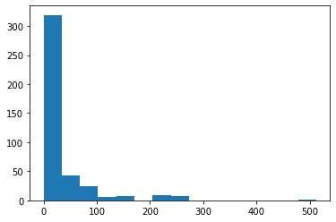

### All of the following code until the section marked "Logistic Regression" was taken from https://www.kaggle.com/alexisbcook/titanic-tutorial for educational purposes.


```python
import numpy as np 
import pandas as pd 
```

The Titanic Data set is split into two separate data sets:  $\textbf{Training and Testing}$.  
The training data set contains 891 observations while the testing data set contains 418.  

The training data set contains the following information about each passenger: 

$
\textbf{Survived} \ \text{(categorical) - 0 (Did not survive) or 1 (Did survive)}$ <br>
$\textbf{Pclass} \ \text{(categorical) - 1 (1st Class), 2 (2nd Class), or 3 (3rd  Class)}$ <br>
$\textbf{Sex} \ \text{(categorical) -  Male or Female}$ <br> 
$\textbf{Age} \ \text{(continuous) - Age of the passenger}$ <br> 
$\textbf{Sibsp} \ \text{(categorical) - Number of siblings/spouses on board}$ <br> 
$\textbf{Parch} \ \text{(categorical) - Number of parents/children on board}$ <br> 
$\textbf{Ticket} \ \text{(categorical) - Ticket Number}$ <br>
$\textbf{Fare} \ \text{(continuous) - Price of ticket}$<br> 
$\textbf{Cabin} \ \text{(categorical) - Cabin Number}$ <br>
$\textbf{Embarked} \ \text{(categorical) - Port of Embarkation}$ <br>
$\text{C = Cherbourg, Q = Queenstown, S = Southampton}$


The testing data set contains all of the same information $\textbf{without the Survived variable}$


```python
# Loading the training and testing data sets.  
train_data = pd.read_csv(r"C:\Users\zachc\OneDrive\Desktop\train.csv")
test_data = pd.read_csv(r"C:\Users\zachc\OneDrive\Desktop\test.csv")
```


```python
# Looking at the percentage of passengers who were women that survived
women = train_data.loc[train_data.Sex == 'female']["Survived"]
rate_women = sum(women)/len(women)

print("% of women who survived:", rate_women)
```

    % of women who survived: 0.7420382165605095
    


```python
# Looking at the percentage of passengers who were men that survived
men = train_data.loc[train_data.Sex == 'male']["Survived"]
rate_men = sum(men)/len(men)

print("% of men who survived:", rate_men)
```

    % of men who survived: 0.18890814558058924
    

By observation, we see that the rate at which women survived the sinking of the Titanic is much higher than that of the men.  This is a good indicator that sex may be a useful predictor for determining survival of passengers.  We'll construct a Random Forest Classifier utilizing the predictor variables $\textbf{Pclass, Sex, SibSp, and Parch}$


```python
# Using a random forest to create a classifier for survival on the Titanic
from sklearn.ensemble import RandomForestClassifier

y1 = train_data["Survived"]

features = ["Pclass", "Sex", "SibSp", "Parch"]
x1_train = pd.get_dummies(train_data[features])
x1_test = pd.get_dummies(test_data[features])

model = RandomForestClassifier(n_estimators=100, max_depth=5, random_state=1)
model.fit(x1_train, y1)
predictions = model.predict(x1_test)

output = pd.DataFrame({'PassengerId': test_data.PassengerId, 'Survived': predictions})
output.to_csv('Tutorial_Submission.csv', index=False)
# print("Your submission was successfully saved!")
```

Once the predictions were made, they were exported to a csv file named "Tutorial Submission" and they were submitted to the Titanic Kaggle challenge found here:  https://www.kaggle.com/c/titanic.  
The classifier had a 77.511% accuracy.  


# Contribution
## Logistic Regression
In this section, we'll conduct a Logistic Regression to create a model which will act as our classifier.

### Before we begin, we'll parse through our training data set to see if there exists any missing values and what variables we'll use for training and testing.  


```python
# Importing some necessary packages
import matplotlib.pyplot as plt

# Checking to see what features in the training data set contain missing values.
train_data.isnull().sum()
```


    PassengerId      0
    Survived         0
    Pclass           0
    Name             0
    Sex              0
    Age            177
    SibSp            0
    Parch            0
    Ticket           0
    Fare             0
    Cabin          687
    Embarked         2
    dtype: int64


```python
test_data.isnull().sum()
```


    PassengerId      0
    Pclass           0
    Name             0
    Sex              0
    Age             86
    SibSp            0
    Parch            0
    Ticket           0
    Fare             1
    Cabin          327
    Embarked         0
    dtype: int64


The training and testing data set have missing values.  In the traininig data set, Age, Cabin, and Embarked have missing values.  In the testing data set, Age, Cabin, and Fare having missing values.  We'll now look at the correlation between each variable and most importantly, the passenger survival.


```python
train_data.corr()
```


<div>
<style scoped>
    .dataframe tbody tr th:only-of-type {
        vertical-align: middle;
    }

    .dataframe tbody tr th {
        vertical-align: top;
    }

    .dataframe thead th {
        text-align: right;
    }
</style>
<table border="1" class="dataframe">
  <thead>
    <tr style="text-align: right;">
      <th></th>
      <th>PassengerId</th>
      <th>Survived</th>
      <th>Pclass</th>
      <th>Age</th>
      <th>SibSp</th>
      <th>Parch</th>
      <th>Fare</th>
    </tr>
  </thead>
  <tbody>
    <tr>
      <th>PassengerId</th>
      <td>1.000000</td>
      <td>-0.005007</td>
      <td>-0.035144</td>
      <td>0.036847</td>
      <td>-0.057527</td>
      <td>-0.001652</td>
      <td>0.012658</td>
    </tr>
    <tr>
      <th>Survived</th>
      <td>-0.005007</td>
      <td>1.000000</td>
      <td>-0.338481</td>
      <td>-0.077221</td>
      <td>-0.035322</td>
      <td>0.081629</td>
      <td>0.257307</td>
    </tr>
    <tr>
      <th>Pclass</th>
      <td>-0.035144</td>
      <td>-0.338481</td>
      <td>1.000000</td>
      <td>-0.369226</td>
      <td>0.083081</td>
      <td>0.018443</td>
      <td>-0.549500</td>
    </tr>
    <tr>
      <th>Age</th>
      <td>0.036847</td>
      <td>-0.077221</td>
      <td>-0.369226</td>
      <td>1.000000</td>
      <td>-0.308247</td>
      <td>-0.189119</td>
      <td>0.096067</td>
    </tr>
    <tr>
      <th>SibSp</th>
      <td>-0.057527</td>
      <td>-0.035322</td>
      <td>0.083081</td>
      <td>-0.308247</td>
      <td>1.000000</td>
      <td>0.414838</td>
      <td>0.159651</td>
    </tr>
    <tr>
      <th>Parch</th>
      <td>-0.001652</td>
      <td>0.081629</td>
      <td>0.018443</td>
      <td>-0.189119</td>
      <td>0.414838</td>
      <td>1.000000</td>
      <td>0.216225</td>
    </tr>
    <tr>
      <th>Fare</th>
      <td>0.012658</td>
      <td>0.257307</td>
      <td>-0.549500</td>
      <td>0.096067</td>
      <td>0.159651</td>
      <td>0.216225</td>
      <td>1.000000</td>
    </tr>
  </tbody>
</table>
</div>


By observation, we see small correlations between Survived and Pclass and Fare.  Of course, Pclass and Fare have a higher correlation.  The higher the class of the passenger, the more they spent on their ticket.  We also see some correlation between the age of the passenger and Pclass.  We can suggest that the older the passenger was, the higher in class they were.  For this first part, we'll simply find the median and mean of Fare for the testing data set and fill in the missing value to the training data set with either the median or mean depending on the variables' distribution.      


```python
# Checking the distribution of Fare.  
fare_test2 = test_data["Fare"]; 
plt.hist(fare_test2,bins = 10); plt.title('Histogram of the Price of Tickets for Titanic (Fare)');
plt.xlabel('Fare Prices'); plt.ylabel('Freqency'); 
```





The distribution of Fare is skewed to the right, so we'll use the median to replace the missing value in the testing data set. 


```python
# # The distribution of Fare is skewed the right so we'll use the median value to replace the 
# missing Fare value for our testing data.
fare2_med = fare_test2.median(); 
fare_test2 = fare_test2.fillna(fare2_med)
```

Now that we've filled in the missing values in the testing data set, we'll begin training our classifer.  We'll use Logistic Regression model as our classifier with the following predictors: $\textbf{Pclass, Sex, Sibsp, Parch, Fare}$.  


```python
from sklearn.linear_model import LogisticRegression 

fare_train2 = pd.DataFrame(train_data["Fare"])
fare_test2 = pd.DataFrame(fare_test2)

# Adding the variable "Fare" to the set of features for training and testing.
x2_train = pd.concat([x1_train,fare_train2],axis = 1)
x2_test = pd.concat([x1_test,fare_test2],axis = 1)

# Creating our model based on training data with and without penalty.
# Using pythons built in Logistic Regression function to learn our model.  
# The penalty term is using l2 regularization.
# The l2 regularizer helps with potential dangers caused by outliers in our predictor variables. 
lr = LogisticRegression()
lrl2 = LogisticRegression(penalty = 'l2') 
trained_model_np = lr.fit(x2_train,y1)
trained_model_l2 = lrl2.fit(x2_train,y1)

# Making predictions on testing data.
test_predict_np = lr.predict(x2_test)
test_predict_l2 = lrl2.predict(x2_test)

# Exporting necessary columns to a CSV file to submit to Kaggle.  
# These two lines were copied from the tutorial.
my_contr_11 = pd.DataFrame({'PassengerId': test_data.PassengerId, 'Survived': test_predict_np})
my_contr_12 = pd.DataFrame({'PassengerId': test_data.PassengerId, 'Survived': test_predict_l2})

# Saving predictions in CSV files.
# These two lines were copied (essentially) from the tutorial
my_contr_11.to_csv('My_Contribution_11.csv', index = False )
my_contr_12.to_csv('My_Contribution_12.csv', index = False )
```

Both classifiers ended up performing the same with a prediction accuracy of 76.794%, which was less accurate than the initial classifier.  We'll implement a new classifer via the method of K-Nearest Neighbors.

## K-Nearest Neighbors

In this section, we'll utilize the same variables as the Random Forest:  $\textbf{Pclass, SibSp, Parch, and Sex}$.  The majority of the data exploration occurred during our implemntation of Logistic Regression, so KNN will simply reap its benefits and We'll simply use the KNN Classifier from SKLearn on our pre-processed data.  


```python
from sklearn.neighbors import KNeighborsClassifier as knn
import math

# Using pythons built in KNN function to learn our model.  
knn_model1 = knn(20);
knn_model1.fit(x1_train, y1);   

# Making predictions on testing data.
test_predict_3 = knn_model1.predict(x1_test)

# Saving predictions in CSV files.
# These two lines were copied (essentially) from the tutorial
my_contr_3 = pd.DataFrame({'PassengerId': test_data.PassengerId, 'Survived': test_predict_1});
my_contr_3.to_csv('My_Contribution_LAST.csv', index = False )
```

The performance of the classifier using K-Nearest Neighbors with K = 20 - 25 performed at 77.751% which is SLIGHTLY better than the original performance of 77.511% via the Random Forest classifier.  

## Conclusion
This blog post discussed a basic introduction into the Titanic data set while using three different kinds of classifiers to predict the survival of passengers:  $\textbf{Random Forest, Logistic Regression, and K-Nearest Neighbors}$.  Each classifier, when trained with the same predictors, performed generally the same.  The Random Forest, Logistic Regression, and K-Nearest Neighbors classifiers performed with an accuracy of 77.511%, 76.794%, and 77.751%, respectively.  Future work would involve implementing more sophisticated and modern models such as SVM, Multiple Neural Nets (Deep Learning), or Gradient Boosted Trees.    
