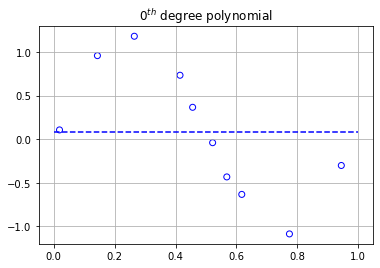
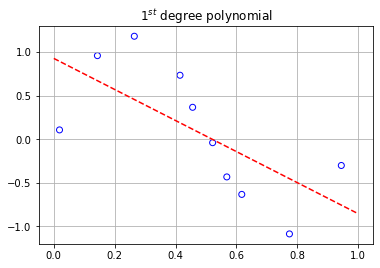
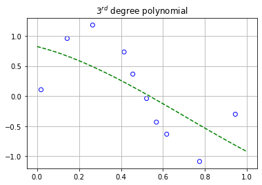
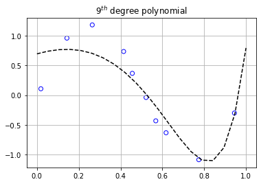
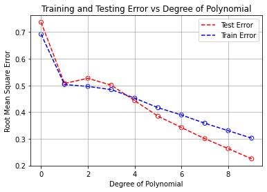
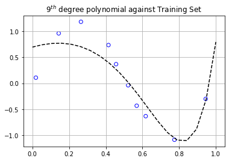
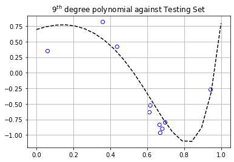
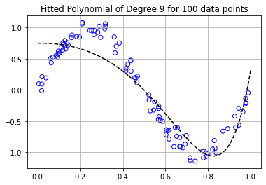
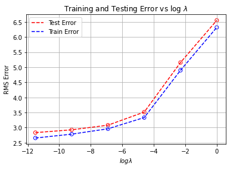

# CSE 5334:  Assignment #2

Goal:  The goal of this assignment is to learn the concept of overfitting using Polynomial Regression.

## I can talk about the computational time differences/pros/cons using Linear Algebra functions from numpy versus numerical methods like using gradient descent to minimize our objective function (root mean square error).  


```python
# Importing necessary packages
import numpy as np
from numpy.linalg import inv
import random, torch, math
from torch.autograd import Variable as var
import pandas as pd
import matplotlib.pyplot as plt
```


```python
# Setting the random seed equal to 0 for reproducible work.
np.random.seed(0)
torch.manual_seed(0)

# Creating synthetic data to use in our practice.
# We're randomly generating 20 data pairs (x,y) to learn a polynomial 
# function which (hopefully) creates a function of best fit.

pi = math.pi; noise = np.random.normal(0,1,20)
x = np.random.uniform(0,1,20); y = np.sin(2*pi*x) + 0.1*noise

x_train = torch.tensor(x[0:10]); x_test = torch.tensor(x[10:]);
y_train = torch.tensor(y[0:10]); y_test = torch.tensor(y[10:]);
N = len(x_train)
```

#### In this section, we'll transform our system of equations into a matrix system.  The coefficients of the polynomial will be found directly.  However, we'll see that we'll require numerical approximations when we reach our polynomial of degree 9 where we'll define a loss function and use gradient descent to aquire our coefficients.

$ \textbf{Current Task:}$ <br>
We'd like to approximate our training data set with four different polynomials of different degrees.  We'll seek to aquire polynomials of degrees 0, 1, 3, and 9 that we hope will best fit our data. 
<br>
<br>
Each data point will be modeled in the following way
<br>
<center>$ \large y_i = \sum_{p=0}^k w_px_i^p,$</center> <br>
where $i = 1,2,...,N$ and $p = 0,1,...,k$.  The value $N$ represents the amount of data pairs and $k$ represents the degree of our polynomial.<br> <br>
We can represent our distinct polynomials with the following matrix system. 

$$
\begin{pmatrix} 
y_1\\ 
y_2\\ 
\vdots\\ 
y_N 
\end{pmatrix} 
= \begin{pmatrix}
1 & x_1 & x_1^2 & \dots & x_1^k \\
1 & x_2 & x_2^2 & \dots & x_2^k \\ 
\vdots & \vdots & \ddots & \vdots & \vdots \\ 
1 & x_N & \dots & \dots & x_N^k 
\end{pmatrix} 
\begin{pmatrix} 
w_0 \\ 
w_1 \\ 
\vdots \\ 
w_k 
\end{pmatrix} 
\iff y = Xw,
$$
<br>
where $y \in \mathbb{R}^N, X \in \mathbb{R}^{N \times (k+1)}$, and $w \in \mathbb{R}^{k+1}$.  In a perfect world, the matrix $X$ is invertible and we can find the coefficients of the polynomials directly.  However, in general, that's not the case.  We'll have to translate our goal into an optimization problem.  For this blog post, we'll define the optimization problem in the following way:

$$
\begin{equation*}
\large
\min_{w \in \mathbb{R}^{k+1}} \left( f(w) := \Big\{ \sum_{i=1}^N \frac{|y_i - \sum_{p=0}^k w_px_i^p |^2}{N} \Big\}^{\frac{1}{2}} \right)
\end{equation*}
$$
<br>
By using the well known optimization technique as our workhorse $\textbf{gradient descent}$, we'll go through the process of finding the coefficients of the different polyomials numerically.  The general algorithm for gradient descent we'll be using in this post is of the following form:
<br>

* Input initial $w^{(0)} \in \mathbb{R}^{k+1}$. 
* For s = 1,2,3,$\dots$, until convergence $\textbf{DO}$
    * Compute and evaluate gradient of $f(w)$ at $w^{(s)}$.
    * Update $w^{(s+1)} = w^{(s)} - \alpha \ (\nabla f(w^{(s)}))^T w^{(s)}$, where $0 < \alpha < 1$.
    * If $|\frac{f(w^{(s+1)}) - f(w^{(s)})|}{f(w^{(s)})}| < \epsilon_{tol}, \ \ \ \textbf{RETURN} \ \ w^{(s+1)}$.  
<br>

The value $\epsilon_{tol}$ will represent our tolerance.  If the relative loss error is below a certain tolerance, we'll stop gradient descent, and use the vector $w$ that was most recently computed.  Throughout the training experiments, the value of $\epsilon_{tol}$ ranges from $10^{-6}$ to $10^{-16}$.  The reason for the differences in tolerance values is in the number of iterations each experiment required to converge.  Some polynomial problems' relative error did not converge to a small enough tolerance level without exceeding $1000$'s of iterations.  Even though the algorithms converged to a smaller relative error, the values of the coefficients and training/testing error were unnoticealbe.  To combat this, we increased the tolerance, noting that the performances at the end were primarily the same.   

## Using Gradient Descent to find coefficients
The upcoming sections are attempting to find polynomials of $\textbf{degrees k = 0, 1, 3, and 9}$ with coefficient vector $\textbf{w} \in \mathbb{R}^{(k+1)}$ which minimizes the objective function above.  The structure of each block of code is similar, only differing in the values $\textbf{k}$.  In addition, the loss values and number of iterations necessary for convergence are displayed at the end of each model.  We set a maximum number of iterations for gradient descent to run to be $\textbf{maxit = 500}$.  There's some additional comments in the code for specific questions that you may have.    

#### Degree 0 Polynomial


```python
# Setting the seed equal to 0 for reproducible work
np.random.seed(0)
torch.manual_seed(0)

# The learning rate without regularizer can be 0.25
# The learning rate with regularizer needs to be small (0.01)
maxit = 500; lr = 0.25; w0 = var(torch.rand(1), requires_grad = True)
loss0 = np.zeros((maxit,1)); tol = 10e-16

# This is our model prediction function
# for the polynomial of degree 0. 
data_0 = torch.ones((N,1)); 

# This is our loss (objective) function
# represented by the root mean square error
# for the polynomial of degree 0. 
def objective0(X,Y):
    return ((Y-X*w0)**2)/N

for j in range(maxit):
    l0 = torch.tensor(0)
    for i in range(N):
        l0 = l0 + objective0(data_0[i],y_train[i])
        if i == N-1:
            l0 = l0**0.5
            if j % 100 == 99:
                print("Loss at iteration", j+1, "is", l0.item())
    l0.backward(retain_graph = True)
    w0.data = w0.data - lr*w0.grad.data
    w0.grad.data.zero_()
    loss0[j] = l0.item(); 
    if j >= 1:
        if abs((loss0[j]-loss0[j-1])/loss0[j]) <= tol:
            print("The algorithm converged after", j, "iterations with a loss value of", l0.item())
            break
```

    The algorithm converged after 18 iterations with a loss value of 0.6921727061271667
    

#### Degree 1 Polynomial


```python
# Setting the seed equal to 0 for reproducible work
np.random.seed(0)
torch.manual_seed(0)

# The learning rate without regularizer can be 0.75
# The learning rate with regularizer needs to be small (0.01)
maxit = 500; lr = 0.25; w1 = var(torch.rand(2), requires_grad = True)
loss1 = np.zeros((maxit,1)); tol = 10e-8

# This is our model prediction function
# for the polynomial of degree 1. 
data_1 = torch.ones(N,2); 
data_1[:,1] = x_train
    
# This is our loss (objective) function
# represented by the root mean square error
# for the polynomial of degree 1. 
def objective1(X,Y):
    return ((Y-torch.dot(X,w1))**2)/N

for j in range(maxit):
    l1 = torch.tensor(0)
    for i in range(N):
        l1 = l1 + objective1(data_1[i,:],y_train[i])
        if i == N-1:
            l1 = l1**0.5
            if j % 100 == 99:
                print("Loss at iteration", j+1, "is", l1.item())
    l1.backward(retain_graph = True)
    w1.data = w1.data - lr*w1.grad.data
    w1.grad.data.zero_()
    loss1[j] = l1.item(); 
    if j >= 1:
        if abs((loss1[j]-loss1[j-1])/loss1[j]) <= tol:
            print("The algorithm converged after", j, "iterations with a loss value of", l1.item())
            break
```

    Loss at iteration 100 is 0.5055839554857863
    Loss at iteration 200 is 0.5033377784125792
    The algorithm converged after 232 iterations with a loss value of 0.5033317508783786
    

#### Degree 3 Polynomial


```python
# Setting the seed equal to 0 for reproducible work
np.random.seed(0)
torch.manual_seed(0)

# The learning rate without regularizer can be 0.75
# The learning rate with regularizer needs to be small (0.01)
maxit = 500; lr = 0.25; w3 = var(torch.rand(4), requires_grad = True)
loss3 = np.zeros((maxit,1)); tol = 10e-6; 

# This is our model prediction function
# for the polynomial of degree 1. 
data_3 = torch.ones(N,4); 
for i in range(1,4):
    data_3[:,i] = x_train**i
    
# This is our loss (objective) function
# represented by the root mean square error
# for the polynomial of degree 1. 
def objective3(X,Y):
    return ((Y-torch.dot(X,w3))**2)/N

for j in range(maxit):
    l3 = torch.tensor(0)
    for i in range(N):
        l3 = l3 + objective3(data_3[i,:],y_train[i])
        if i == N-1:
            l3 = l3**0.5
            if j % 100 == 99:
                print("Loss at iteration", j+1, "is", l3.item())
    l3.backward(retain_graph = True)
    w3.data = w3.data - lr*w3.grad.data
    w3.grad.data.zero_()
    loss3[j] = l3.item(); 
    if j >= 1:
        if abs((loss3[j]-loss3[j-1])/loss3[j]) <= tol:
            print("The algorithm converged after", j, "iterations with a loss value of", l3.item())
            break
```

    Loss at iteration 100 is 0.5041987617732306
    Loss at iteration 200 is 0.4960100291725651
    Loss at iteration 300 is 0.49100230776624176
    Loss at iteration 400 is 0.48748438608800965
    Loss at iteration 500 is 0.48464758619463927
    

#### Degree 9 Polynomial


```python
# Setting the seed equal to 0 for reproducible work
np.random.seed(0)
torch.manual_seed(0)

# The learning rate without regularizer can be 0.75
# The learning rate with regularizer needs to be small (0.01)
maxit = 500; lr = 0.25; w9 = var(torch.rand(N), requires_grad = True)
loss9 = np.zeros((maxit,1)); tol = 10e-6

# This is our model prediction function
# for the polynomial of degree 9. 
data_9 = torch.ones((10,10)); 
for i in range(1,10):
    data_9[:,i] = x_train**i
    
# This is our loss (objective) function
# represented by the root mean square error
# for the polynomial of degree 9. 
def objective9(X,Y):
    return ((Y-torch.dot(X,w9))**2)/N
#     return (Y-torch.dot(X,w9))**2 

for j in range(maxit):
    l9 = torch.tensor(0)
    for i in range(N):
        l9 = l9 + objective9(data_9[i,:],y_train[i])
        if i == N-1:
            l9 = l9**0.5
            if j % 100 == 99:
                print("Loss at iteration", j+1, "is", l9.item())
    l9.backward(retain_graph = True)
    w9.data = w9.data - lr*w9.grad.data
    w9.grad.data.zero_()
    loss9[j] = l9.item(); 
    if j >= 1:
        if abs((loss9[j]-loss9[j-1])/loss9[j]) <= tol:
            print("The algorithm converged after", j, "iterations with a loss value of", l9.item())
            break
```

    Loss at iteration 100 is 0.39447062074599154
    Loss at iteration 200 is 0.36169343966466955
    Loss at iteration 300 is 0.33636061549587926
    Loss at iteration 400 is 0.31413465615402586
    Loss at iteration 500 is 0.29505579756452194
    

#### Table with Weights
The table below displays the entries of each $w \in \mathbb{R}, \mathbb{R}^2, \mathbb{R}^4,$ and $\mathbb{R}^{10}$, respectively, as generated by the above algorithms.  

|       |    0   |    1   |    3   |    9   |
|:-----:|:------:|:------:|:------:|:------:|
| $w_0$ | 0.0863 | 0.9300 | 0.8253 | 0.6953 |
| $w_1$ |        | -1.786 |-0.8878 | 1.0078 |
| $w_2$ |        |        |-1.6216 |-2.9706 |
| $w_3$ |        |        | 0.7623 |-2.4817 |
| $w_4$ |        |        |        |-1.1949 |
| $w_5$ |        |        |        | 0.1145 |
| $w_6$ |        |        |        | 0.6941 |
| $w_7$ |        |        |        | 1.5954 |
| $w_8$ |        |        |        | 1.4780 |
| $w_9$ |        |        |        | 1.8564 |

#### Some Plots
In this section, we're taking all of the vectors of weights $w$ and creating the polynomials to plot against our training data.  We would like to see how well each polynomial looks with respect to the training data.  


```python
# Converting our weight tensors to numpy arrays
wnp_0 = w0.detach().numpy(); wnp_0 = np.flip(wnp_0)
wnp_1 = w1.detach().numpy(); wnp_1 = np.flip(wnp_1)
wnp_3 = w3.detach().numpy(); wnp_3 = np.flip(wnp_3)
wnp_9 = w9.detach().numpy(); wnp_9 = np.flip(wnp_9)

polynomial0 = np.poly1d(wnp_0); polynomial1 = np.poly1d(wnp_1); 
polynomial3 = np.poly1d(wnp_3); polynomial9 = np.poly1d(wnp_9); 

x_axis = np.linspace(0,1,20)

# Subplot 1.1
plt.figure()
plt.scatter(x_train,y_train, facecolors = 'None', edgecolors = 'blue')
plt.plot(x_axis,polynomial0(x_axis),'b--'); plt.grid()
plt.title("$0^{th}$ degree polynomial")

# Subplot 1.2
plt.figure()
plt.scatter(x_train,y_train, facecolors = 'None', edgecolors = 'blue')
plt.plot(x_axis,polynomial1(x_axis), 'r--'); plt.grid()
plt.title("$1^{st}$ degree polynomial")

# Subplot 2.1
plt.figure()
plt.scatter(x_train,y_train, facecolors = 'None', edgecolors = 'blue')
plt.plot(x_axis,polynomial3(x_axis), 'g--'); plt.grid()
plt.title("$3^{rd}$ degree polynomial")

# Subplot 2.2
plt.figure()
plt.scatter(x_train,y_train, facecolors = 'None', edgecolors = 'blue')
plt.plot(x_axis,polynomial9(x_axis), 'k--'); plt.grid()
plt.title("$9^{th}$ degree polynomial")
```


    Text(0.5, 1.0, '$9^{th}$ degree polynomial')














The graphs above display the 10 data points as scattered points with the dotted lines representing the polynomials that were modeled to fit them.  As we can clearly see, the degree 0, 1, and 3 polynomials don't fit the training data very well.  However, if we turn our attention to the 9th degree polynomial, we can see an increase in the performance of its ability to fit the training data.  
Our next objective will be to re-run a similar experiment with polynomial regression, but this time we'll find models of all degrees between 0 and 9.  We'll then gather each models' final loss value and create a table to compare.  We'll finally calculate the testing error, then plot the training error we collected, and plot them against each other.  


```python
### Checking Training vs Testing Error
# Setting the seed equal to 0 for reproducible work
np.random.seed(0); torch.manual_seed(0)
loss_final = np.zeros((N,1)); W = torch.zeros((10,10))
maxit = 500; lr = 0.25; tol = 10e-16; info = np.zeros((10,3))

for iteration in range(10):
    loss = np.zeros((maxit,1))
    # The learning rate without regularizer can be 0.75
    # The learning rate with regularizer needs to be small (0.01)  
    w = var(torch.rand(iteration+1), requires_grad = True)
    data = torch.ones(N,iteration+1);
    if iteration >= 1:
        for k in range(1,iteration+1):
            data[:,k] = x_train**k
            
    # This is our loss (objective) function
    # represented by the root mean square error
    # for the polynomial of degree 0 and arbitary degrees.     
    def objective0(X,Y):
        return ((Y-X*w)**2)/N

    def objective_any(X,Y):
        return ((Y-torch.dot(X,w))**2)/N
   
    for j in range(maxit):
        l = torch.tensor(0)
        for i in range(N):
            if iteration == 0:
                l = l + objective0(data[i],y_train[i])
                if i == N-1:
                    l = l**0.5
            else:
                l = l + objective_any(data[i,:],y_train[i])
                if i == N-1:
                    l = l**0.5
        l.backward(retain_graph = True)
        w.data = w.data - lr*w.grad.data
        w.grad.data.zero_()
        loss[j] = l.item();
        
#         if j >= 1:
#             if abs((loss[j]-loss[j-1])/loss[j]) <= tol:
#                 print("For the degree", iteration, "polynomial, the algorithm converged after", j, "iterations with a loss value of", l.item())
#                 break
#             if j % maxit == maxit - 1:
#                 print("The algorithm for the polynomial of degree", iteration, "required the maximum number of iterations for completion with a loss value of", l.item())     
    W[0:len(w),iteration] = w    
    loss_final[iteration] = l.item()
    info[iteration] = [iteration, j+1, l.item()]
```

| Deg |  Loss  |
|:---:|:------:|
|  0  | 0.6922 |
|  1  | 0.5033 |
|  2  | 0.4964 |
|  3  | 0.4844 |
| 4   | 0.4526 |
| 5   | 0.4166 |
| 6   | 0.3893 |
| 7   | 0.3584 |
| 8   | 0.3304 |
| 9   | 0.3024 |

In the block of code below, we're evaluating the testing error of the polynomials we created by testing them on our testing data set.  


```python
Testing_error = torch.zeros((N,1))
                    
def objective0(X,Y,w_new):
    return ((Y-X*w_new)**2)/N

def objective_any(X,Y,w_new):
    return ((Y-torch.dot(X,w_new))**2)/N

for k in range(10):
    data_test = torch.ones(N,k+1)
    if k >= 1:
        for j in range(1,k+1):
            data_test[:,j] = x_test**j
    
    l_test = torch.tensor(0)
    for i in range(N):
        if k == 0:
            l_test = l_test + objective0(data_test[i],y_test[i],W[0,0])
            if i == N-1:
                l_test = l_test**0.5
        else:
            l_test = l_test + objective_any(data_test[i,:],y_test[i],W[0:k+1,k])
            if i == N-1:
                l_test = l_test**0.5
    Testing_error[k] = l_test
```


```python
Test_e = Testing_error.detach().numpy()
```


```python
plt.scatter(np.linspace(0,9,10),Test_e, facecolors = 'None', edgecolors = 'red')
plt.plot(Test_e, 'r--')
plt.scatter(np.linspace(0,9,10),info[:,2], facecolors = 'None', edgecolors = 'blue')
plt.plot(info[:,2], 'b--')
plt.grid(); plt.title("Training and Testing Error vs Degree of Polynomial")
plt.xlabel("Degree of Polynomial"); plt.ylabel("Root Mean Square Error")
plt.legend(['Test Error', 'Train Error'])
```


    <matplotlib.legend.Legend at 0x14ed0b19670>





If we look at the graph above, we can clearly see that as the degree of the polynomial increases, the better we are at minimizing our objective function, and in turn, our prediction accuracy.  However, there's something quite interesting about the testing error being lower than the training error once the degree of the polynomial exceeds a degree of 4.  If we look at the graph below which shows the plot of the degree 9 polynomial plotted against the training and testing data, we can clearly see why.


```python
plt.figure()
plt.scatter(x_train,y_train, facecolors = 'None', edgecolors = 'blue')
plt.plot(x_axis,polynomial9(x_axis), 'k--'); plt.grid()
plt.title("$9^{th}$ degree polynomial against Training Set")

plt.figure()
plt.scatter(x_test,y_test, facecolors = 'None', edgecolors = 'blue')
plt.plot(x_axis,polynomial9(x_axis), 'k--'); plt.grid()
plt.title("$9^{th}$ degree polynomial against Testing Set")
```


    Text(0.5, 1.0, '$9^{th}$ degree polynomial against Testing Set')








There's a mini cluster of points gathered around $x \in (0.6,0.7)$ in the testing set, whereas the training set has points spread out more uniformly.  The graph of the polynomial is nearer to those particular points of the testing set, resulting in a lower testing error than the training error.  The analysis is the same for the polynomials of degrees 4 through 8.  In general, the testing error is higher than the training error.  This is a situation showing that it's not always the case.   

#### Generating more Data (200 data points)
Here, we're going to generate 200 additional data points and split 100/100 to training and testing, respectively.  We'll only use the 9th degree polynomial as the base model.  


```python
new_data = np.random.uniform(0,1,200); new_noise = np.random.normal(0,1,200); 
outputs = np.sin(2*pi*new_data) + 0.1*new_noise

new_train_x = torch.tensor(new_data[0:100]); new_test_x = torch.tensor(new_data[100:])
new_train_y = torch.tensor(outputs[0:100]); new_test_y = torch.tensor(outputs[100:])
```

We've raised the maximum number of iterations for convergence to 1000 due to the increase of data points.  Near the bottom, you can see the changes of the objective function values every 100 iterations.  


```python
# Setting the seed equal to 0 for reproducible work
np.random.seed(0)
torch.manual_seed(0)

# The learning rate without regularizer can be 0.75
# The learning rate with regularizer needs to be small (0.01)
maxit = 1000; lr = 0.25; w9_new = var(torch.rand(N), requires_grad = True)
loss9_new = np.zeros((maxit,1)); tol = 10e-16; N_new = 100

# This is our model prediction function
# for the polynomial of degree 9. 
data_9_new = torch.ones((N_new,10)); 
for i in range(1,10):
    data_9_new[:,i] = new_train_x**i
    
# This is our loss (objective) function
# represented by the root mean square error
# for the polynomial of degree 9. 
def objective9(X,Y):
    return ((Y-torch.dot(X,w9_new))**2)/N_new

for j in range(maxit):
    l9_new = torch.tensor(0)
    for i in range(N_new):
        l9_new = l9_new + objective9(data_9_new[i,:], new_train_y[i])
        if i == N_new-1:
            l9_new = l9_new**0.5
            if j % 100 == 99:
                print("Loss at iteration", j+1, "is", l9_new.item())
    l9_new.backward(retain_graph = True)
    w9_new.data = w9_new.data - lr*w9_new.grad.data
    w9_new.grad.data.zero_()
    loss9_new[j] = l9_new.item(); 
    if j >= 1:
        if abs((loss9_new[j]-loss9_new[j-1])/loss9_new[j]) <= tol:
            print("The algorithm converged after", j, "iterations with a loss value of", l9_new.item())
            break
```

    Loss at iteration 100 is 0.30063835343681206
    Loss at iteration 200 is 0.2822168588728464
    Loss at iteration 300 is 0.2689194723966921
    Loss at iteration 400 is 0.25878464792863437
    Loss at iteration 500 is 0.2510806877924188
    Loss at iteration 600 is 0.24514364726903706
    Loss at iteration 700 is 0.2404356427065258
    Loss at iteration 800 is 0.2365552143143991
    Loss at iteration 900 is 0.23321963253292427
    Loss at iteration 1000 is 0.23023758201233188
    

Similar to the graphs above, we'll plot the 9th order polynomial along with a scatterplot of the training data.  


```python
wnp_new = w9_new.detach().numpy(); wnp_new = np.flip(wnp_new)
polynomial_new = np.poly1d(wnp_new)

x_axis = np.linspace(0,1,100)

plt.figure()
plt.scatter(new_train_x,new_train_y, facecolors = 'None', edgecolors = 'blue')
plt.plot(x_axis,polynomial_new(x_axis),'k--'); plt.grid()
plt.title("Fitted Polynomial of Degree 9 for 100 data points")
```


    Text(0.5, 1.0, 'Fitted Polynomial of Degree 9 for 100 data points')





### Regularization
In this section, we'll use the art of $L2$ regularization to potentially enhance the performance of our $9^{th}$ degree polynomial.  We'll briefly discuss the general form of the new optimization problem. 
Let's first recall our original optimization problem:

<br>
$$
\begin{equation*}
\large
\min_{w \in \mathbb{R}^{k+1}} \left( f(w) := \Big\{ \sum_{i=1}^N \frac{|y_i - \sum_{p=0}^k w_px_i^p |^2}{N} \Big\}^{\frac{1}{2}} \right)
\end{equation*}
$$

We'll first remove the square root, and add an additional term we'll call the $\textbf{penalty term}$.  The updated problem becomes

<br>
$$
\begin{equation*}
\large
\min_{w \in \mathbb{R}^{k+1}} \left( F(w) := \frac{1}{2}\sum_{i=1}^N \frac{|y_i - \sum_{p=0}^k w_px_i^p |^2}{N} + \frac{\lambda}{2} \sum_{p=0}^k w_p^2 \right)
\end{equation*}
$$

What we've essentially done is turn our root mean squared objective function into a mean squared error function.  The additional term $\sum_{p=0}^k w_p^2$ is added in order to help with the prevention of outliers in our data, but from a more mathematical point of view, the additional term is realized when the residual errors of the training and testing data are assumed to be drawn from a normal distribution with a mean of zero and some standard deviation $\tau$.  The details of its derivation can be found 
[here](https://bjlkeng.github.io/posts/probabilistic-interpretation-of-regularization/).  This helps minimize the chaotic nature of the values of the coefficents.  Essentially, this will help smooth our polynomial function, and in turn create a better prediction accuracy on the testing data.  Lastly, the factors of $\frac{1}{2}$ are added simply for scaling purposes.  

We'll explore the effect $\lambda$ has on the overall performance of the polynomial model.  The set of values $\lambda$ will be is $[1, 10^{-1}, 10^{-2}, 10^{-3}, 10^{-4}, 10^{-5}]$.  We'll then look at the differences between training and testing objective function values.  The code below is similar to everything we've seen so far, but now we'll be looping over different values of $\lambda$.   


```python
# Setting the seed equal to 0 for reproducible work
np.random.seed(0)
torch.manual_seed(0)

Lamb = [1,0.1,0.01,0.001,0.0001,0.00001]

# The learning rate without regularizer can be 0.25
# The learning rate with regularizer needs to be small (0.01)
N_new = 100; 
maxit = 1000; lr = 0.001; w9_new = var(torch.rand(10), requires_grad = True)
loss9_new = np.zeros((maxit,1)); tol = 10e-16; W_new = torch.zeros((10,6))

loss_values_final = np.zeros((len(Lamb),1))

# This is our model prediction function
# for the polynomial of degree 9. 
data_9_new = torch.ones((N_new,10)); 
for i in range(1,10):
    data_9_new[:,i] = new_train_x**i
        
# This is our loss (objective) function
# represented by the root mean square error
# for the polynomial of degree 9. 
def objective9(X,Y):
    return ((Y-torch.dot(X,w9_new))**2 + lamb*torch.dot(w9_new,w9_new))/2

iteration = 0
for lamb in Lamb:
    for j in range(maxit):
        l9_new = torch.tensor(0)
        for i in range(N_new):
            l9_new = l9_new + objective9(data_9_new[i,:], new_train_y[i])
#         if j % 100 == 99:
#             print("Loss at iteration", j+1, "is", l9_new.item())
        l9_new.backward(retain_graph = True)
        w9_new.data = w9_new.data - lr*w9_new.grad.data
        w9_new.grad.data.zero_()
        loss9_new[j] = l9_new.item(); 
        if j >= 1:
            if abs((loss9_new[j]-loss9_new[j-1])/loss9_new[j]) <= tol:
                print("The algorithm converged after", j, "iterations with a loss value of", l9_new.item())
                break
            if j % maxit == (maxit - 1):
                print("The algorithm took", maxit, "iterations with a loss value of", l9_new.item())
    W_new[:,iteration] = w9_new
    loss_values_final[iteration] = l9_new.item()
#     print(loss_values)
    iteration += 1 
print("Training Complete!")
```

    The algorithm converged after 164 iterations with a loss value of 21.77750054056701
    The algorithm took 1000 iterations with a loss value of 15.492390250675683
    The algorithm took 1000 iterations with a loss value of 7.835882510226667
    The algorithm took 1000 iterations with a loss value of 4.790024259555591
    The algorithm took 1000 iterations with a loss value of 3.927758838713757
    The algorithm took 1000 iterations with a loss value of 3.5337260657743457
    Training Complete!
    

As we see above from the objective function values, as $\lambda$ decreases from $1$ to $10^{-5}$, the objective function values decrease.  This makes sense since we're adding smaller and smaller penalty terms each time.  Below, we'll calculate the training and testing errors with the original objective functon 

$$
\begin{equation*}
\large
f(w) := \Big\{ \sum_{i=1}^N \frac{|y_i - \sum_{p=0}^k w_px_i^p |^2}{N} \Big\}^{\frac{1}{2}}, 
\end{equation*}
$$

since the additional penalty term is unaffected by performance.  


```python
Testing_error_new = torch.zeros((6,1))
Training_error_new = torch.zeros((6,1))

Lamb = [1,0.1,0.01,0.001,0.0001,0.00001]
data_9_test = torch.ones(100,10)
data_9_train = data_9_new

for j in range(1,10):
    data_9_test[:,j] = new_test_x**j

def objective9(X,Y,w_new):
    return (Y-torch.dot(X,w_new))**2 

iteration = 0
for lamb in Lamb:
    l_test = torch.tensor(0)
    l_train = torch.tensor(0)
    for i in range(100):
        l_test = l_test + objective9(data_9_test[i,:],new_test_y[i],W_new[:,iteration])
        l_train = l_train + objective9(data_9_train[i,:],new_train_y[i],W_new[:,iteration])
        if i == 99:
            l_test = l_test**0.5
            l_train = l_train**0.5
    Testing_error_new[iteration] = l_test
    Training_error_new[iteration] = l_train
    iteration += 1
```

In this snipit of code below, we're creating arrays of the testing and training error, and an array of $log(\lambda)$ for each $\lambda$.  Then we'll plot the testing and training error versus $log(\lambda)$.  


```python
Test_e_new = Testing_error_new.detach().numpy()
Train_e_new = Training_error_new.detach().numpy()

logLamb = np.log(Lamb)
logLamb = np.flip(logLamb)
Test_e_new = np.flip(Test_e_new)
Train_e_new = np.flip(Train_e_new)
```


```python
plt.scatter(logLamb,Test_e_new, facecolors = 'None', edgecolors = 'red')
plt.plot(logLamb, Test_e_new, 'r--')
plt.scatter(logLamb,Train_e_new,facecolors = 'None', edgecolors = 'blue')
plt.plot(logLamb, Train_e_new, 'b--')
plt.grid(); plt.title("Training and Testing Error vs log $\lambda$ ")
plt.xlabel("$ log \lambda$ "); plt.ylabel("RMS Error")
plt.legend(['Test Error', 'Train Error'])
```


    <matplotlib.legend.Legend at 0x14ed0f116d0>





As we can clearly see from the figure above, the larger $\lambda$ gets, the larger the training and testing error become.  This suggests that the lower the value $\lambda$, the better the performance of the polynomial model.  

### Conclusion
Throughout experimentation, we saw that the $9^{th}$ order polynomial generally performed better 
